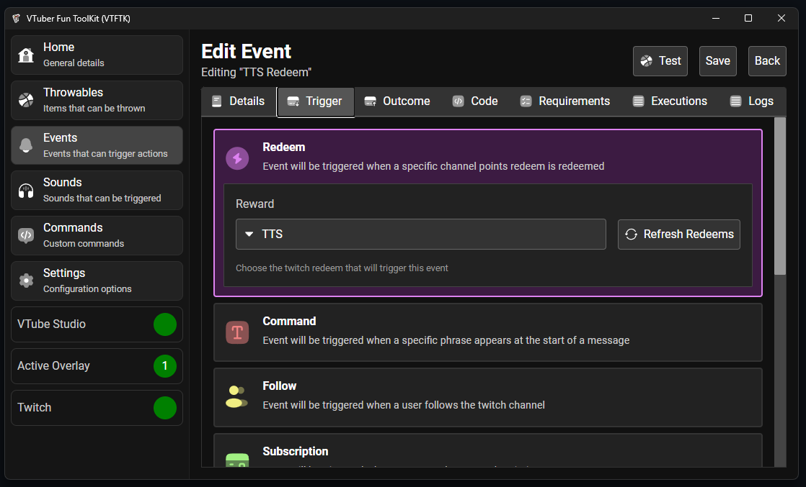
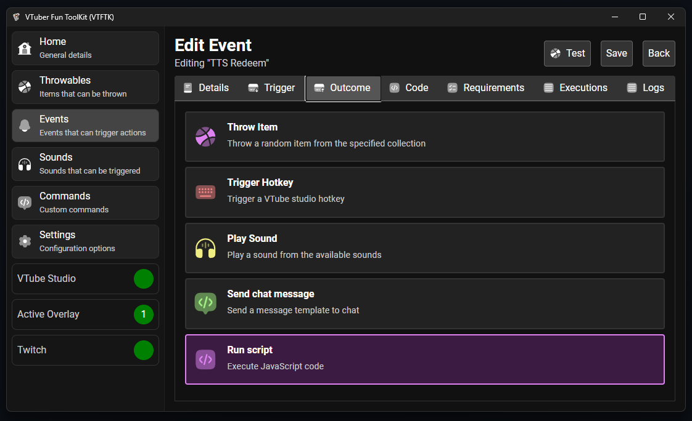
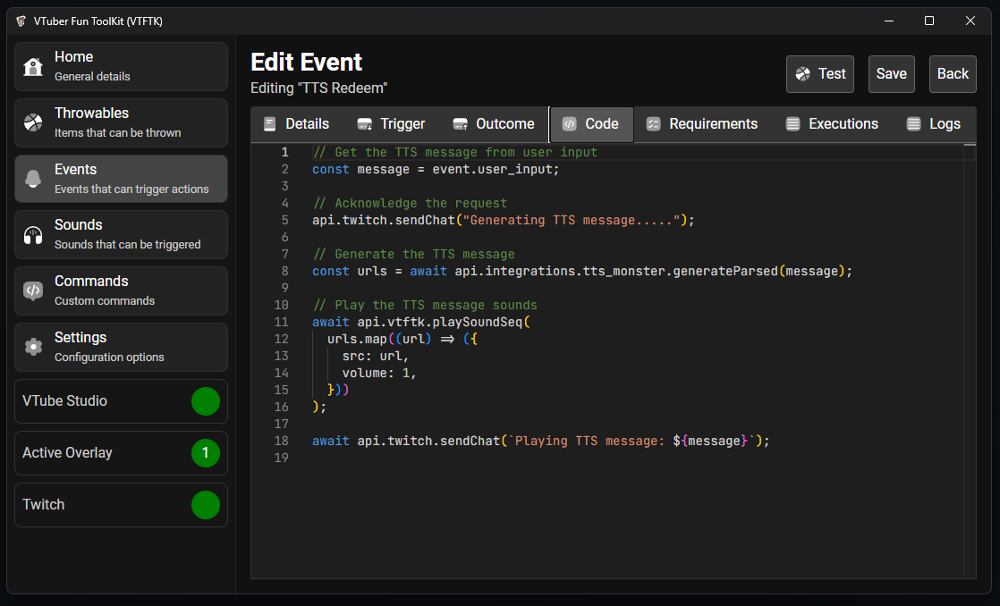

```js
// Get the TTS message from user input
const message = event.user_input;

// Acknowledge the request
api.twitch.sendChat("Generating TTS message.....");

// Generate the TTS message
const urls = await api.integrations.tts_monster.generateParsed(message);

// Play the TTS message sounds
await api.vtftk.playSoundSeq(
  urls.map((url) => ({
    src: url,
    volume: 1,
  }))
);

await api.twitch.sendChat(`Playing TTS message: ${message}`);
```