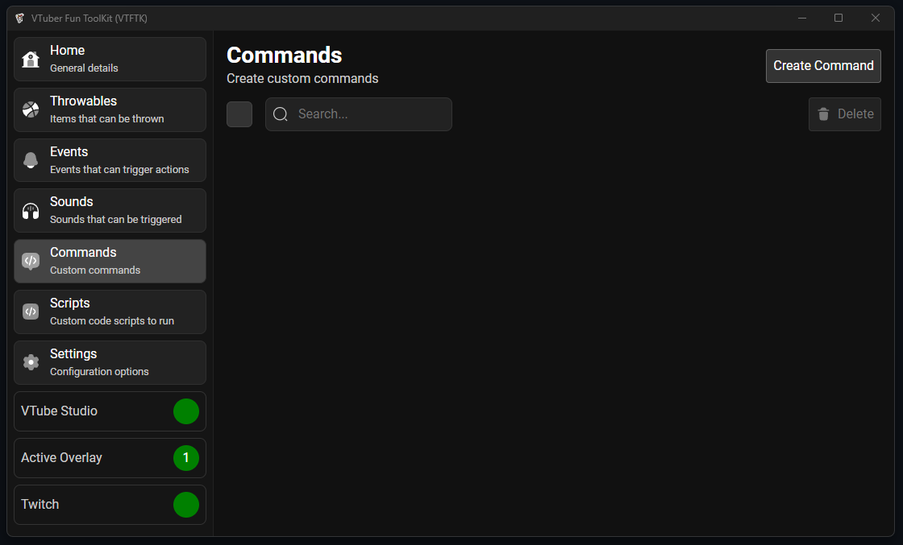

import { LinkCard } from "@astrojs/starlight/components";

Twitch commands that can respond with simple responses or take advantage of 
powerful JavaScript code.

<LinkCard
  title="Creating Template"
  description="Creating a simple command using a response template"
  href="/guides/commands/2-creating-template"
/>

<LinkCard
  title="Creating Script"
  description="Create an advanced command using scripting for more dynamic responses and actions"
  href="/guides/events/3-creating-script"
/>

<LinkCard
  title="Examples"
  description="Examples for some common and useful commands"
  href="/examples/commands/examples"
/>

