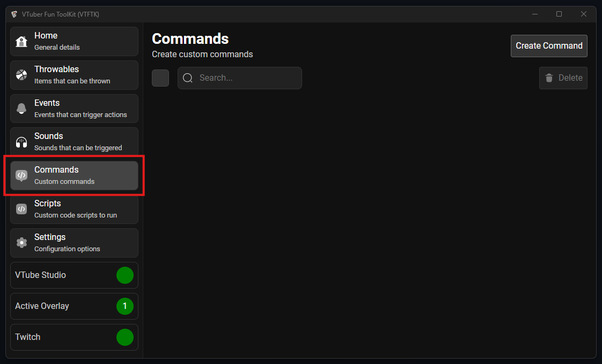
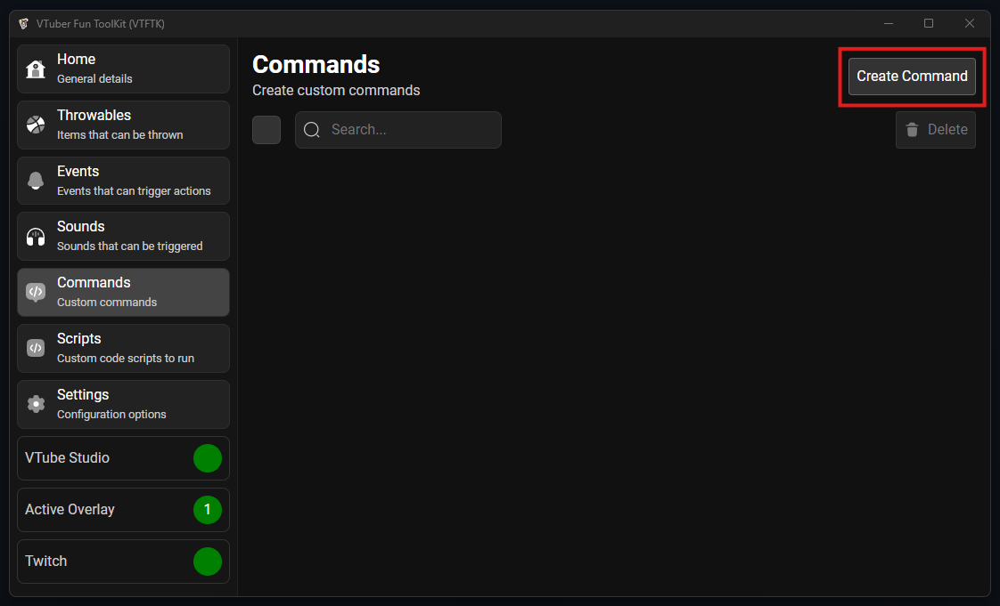
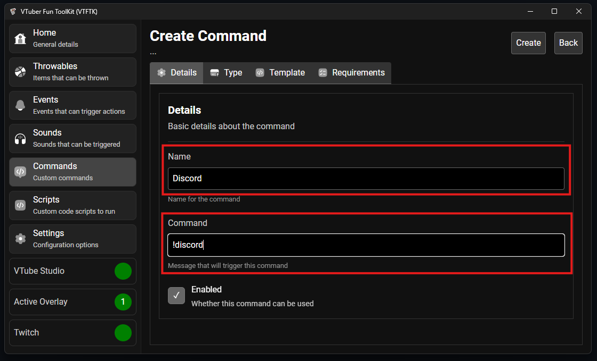
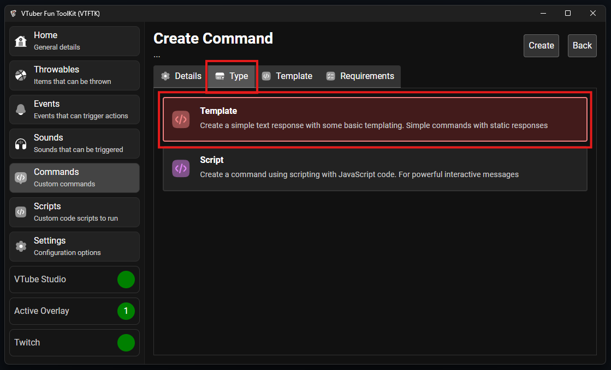
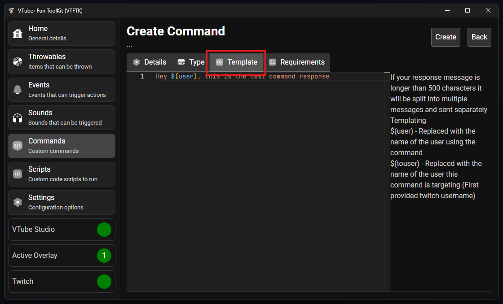
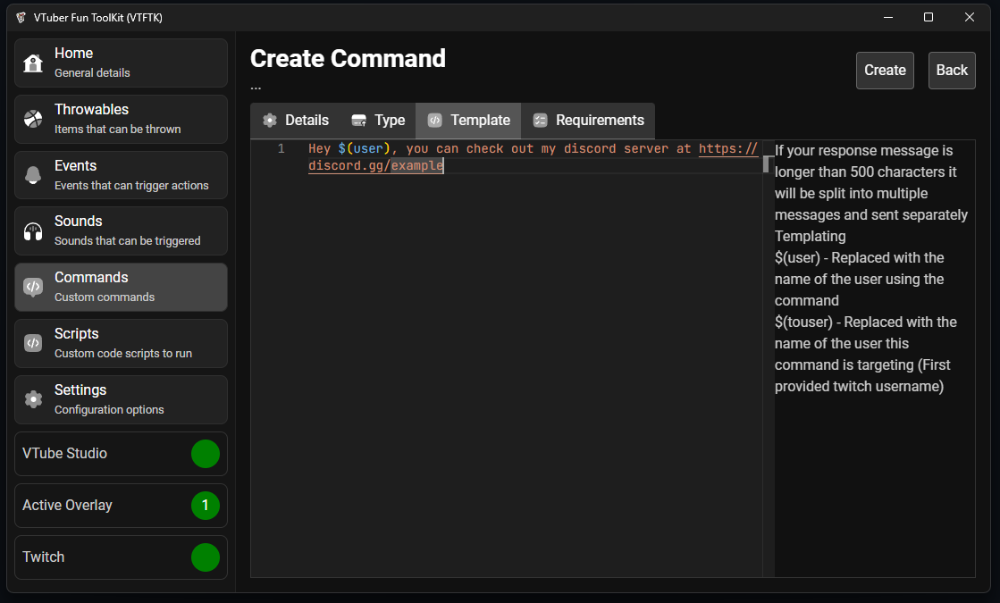
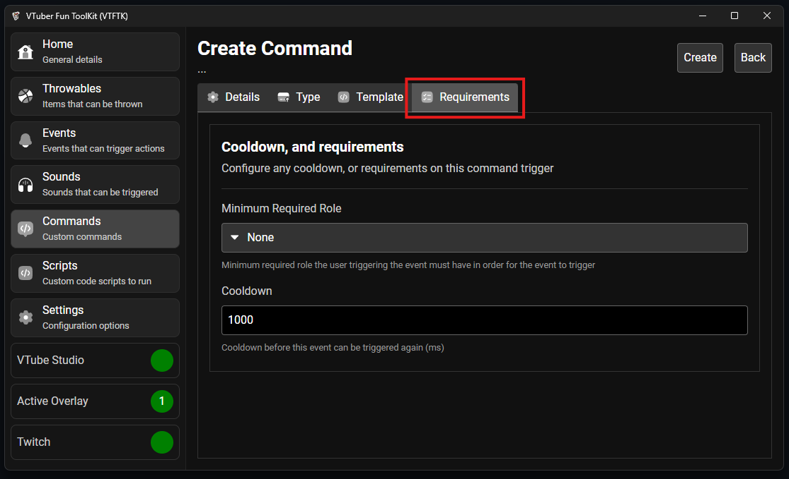
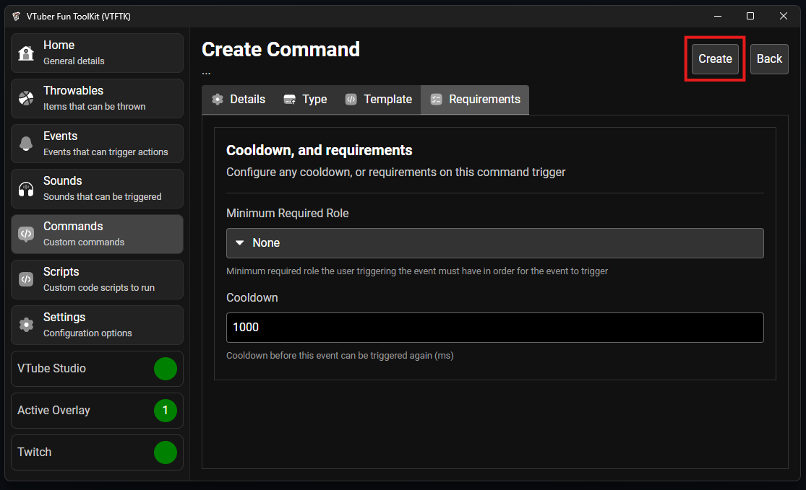
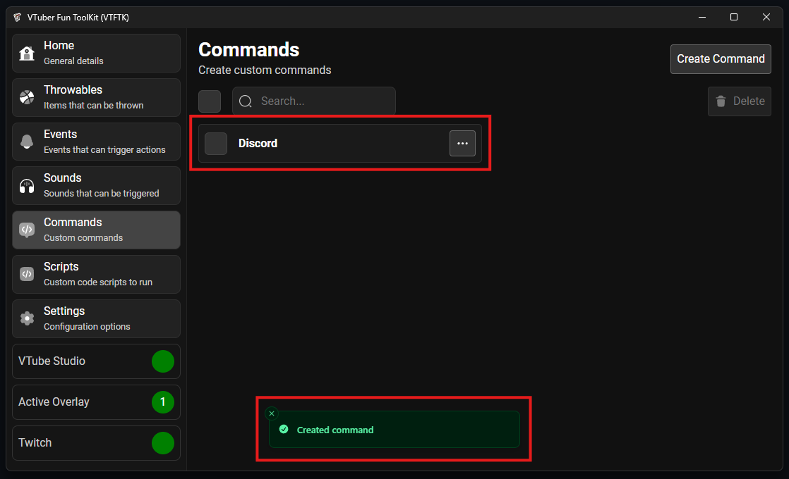
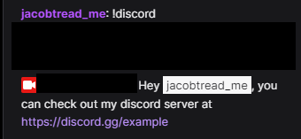

Template commands are simple command that response using a fixed response template, this is for 
simple commands that have a static response such as a !discord command that response with your discord
server link

To create a new template command visit the "Commands" tab from the sidebar:



Then press "Create Command":



Provide a name for your command, and set the "Command", this is the word that must appear at the start of the message in order 
to trigger the command:



Select the "Type" tab and ensure the "Template" option is selected:



Then select the "Template" tab, here you will put your template message in:



For our discord command we will use the following template:

```
Hey $(user), you can check out my discord server at https://discord.gg/example
```

When the message is sent the `$(user)` will be replaced with the name of the user 
who used the command



You can then head to the "Requirements" tab to choose who is allowed to use the command and the cooldown between uses



After you've configured your command press the "Create" button to create your command:



You'll be taken back to the commands list with your new command at the top:



You can then test your command on twitch by typing out the command message into chat:

