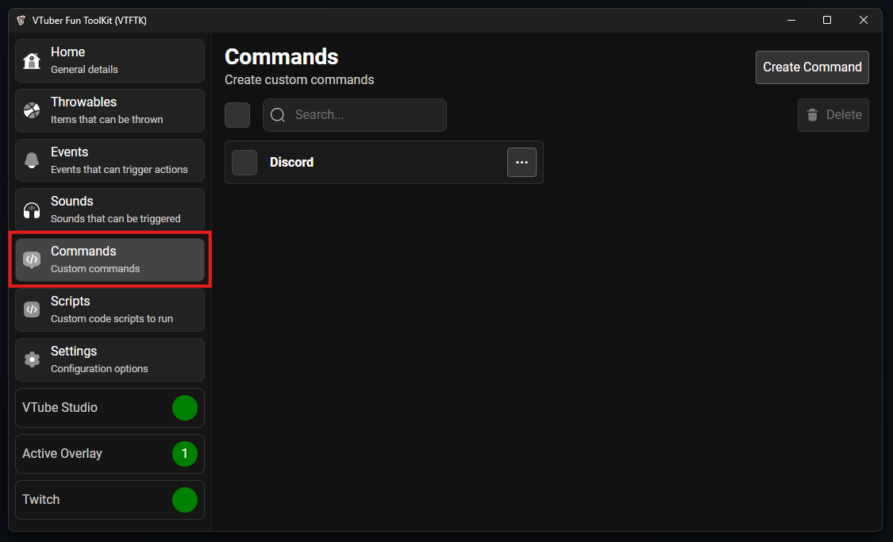
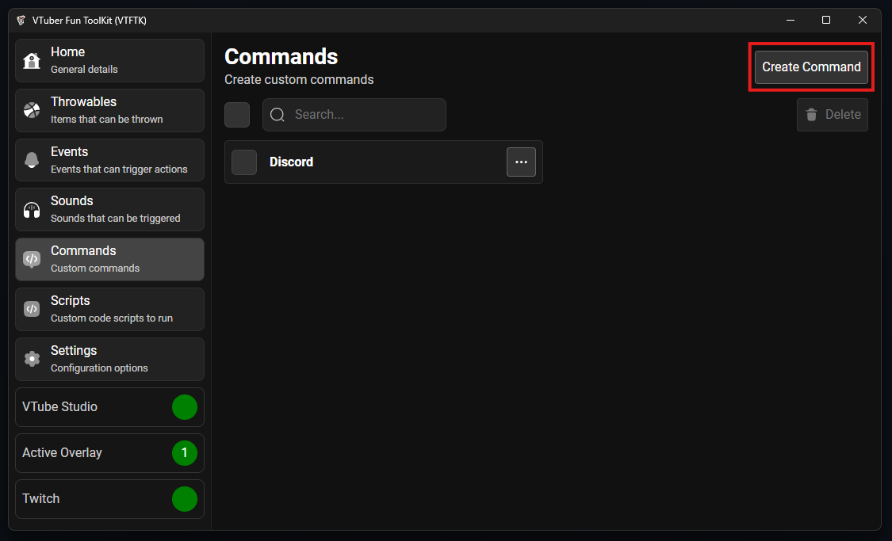
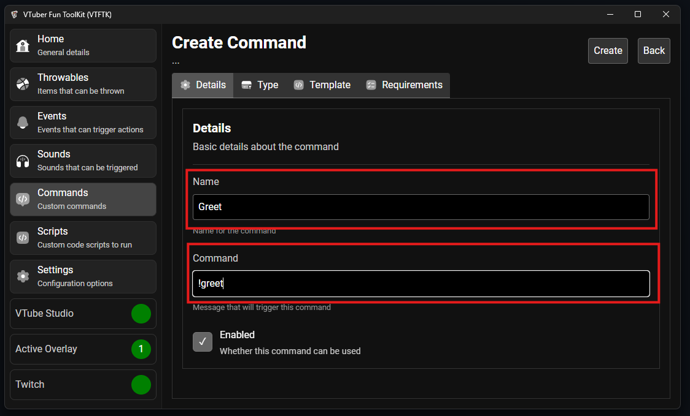
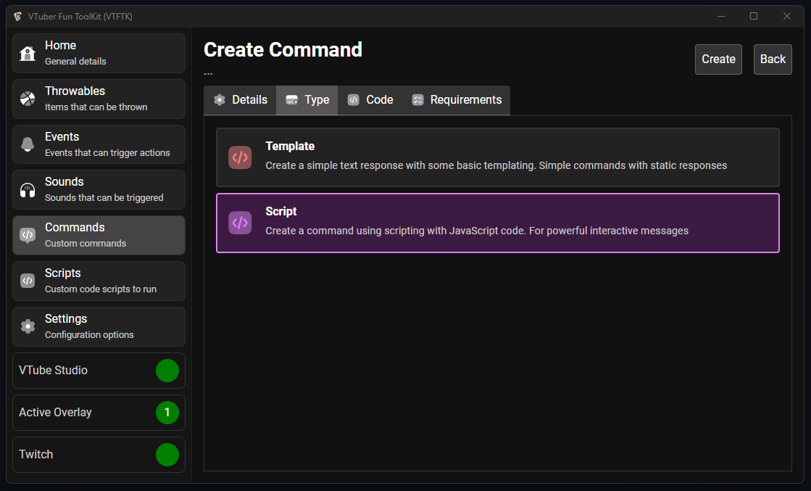
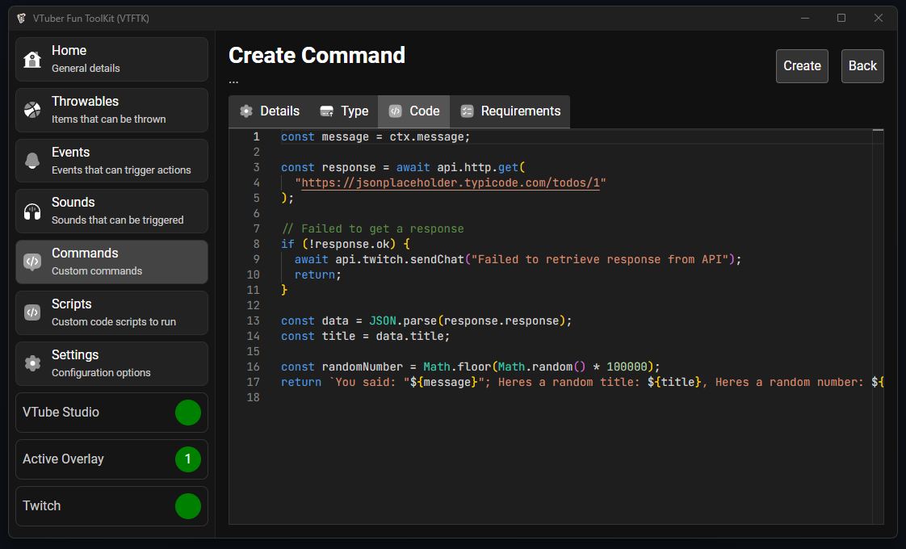
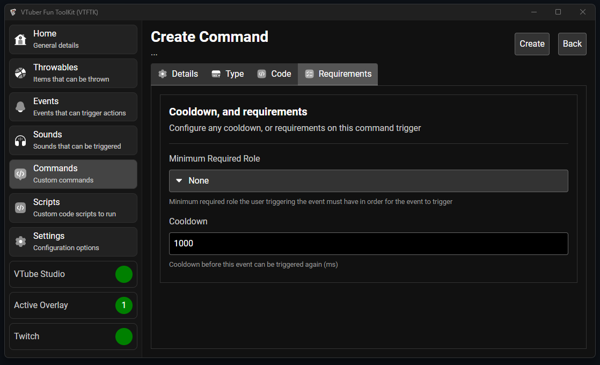
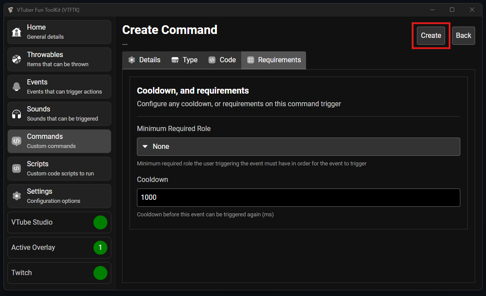
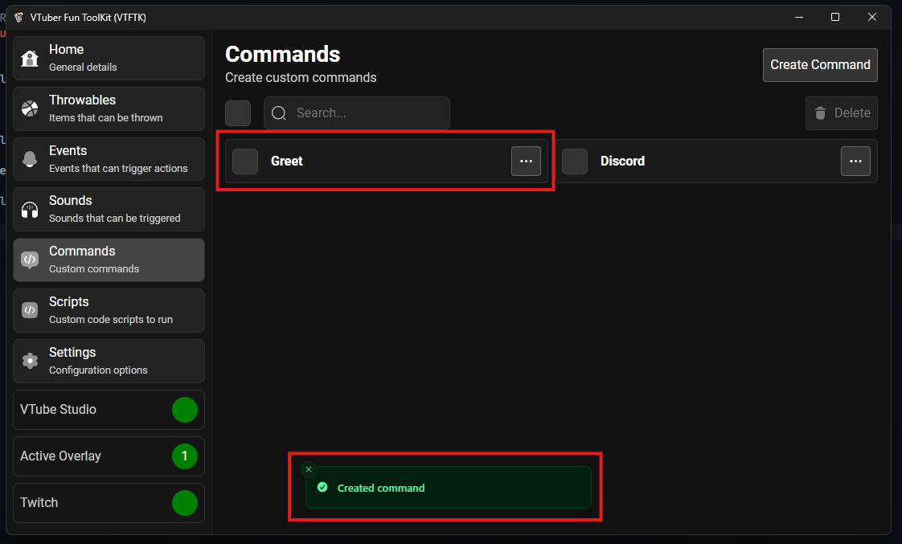
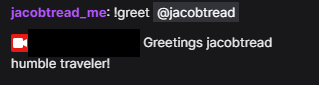

Script commands are powerful commands that allow you to run JavaScript code to
provide dynamic responses and interact with different things through code.

To create a new script command visit the "Commands" tab from the sidebar:



Then press "Create Command":



Provide a name for your command, and set the "Command", this is the word that must appear at the start of the message in order 
to trigger the command, here we are going to create a greet command that greets someone with a random greeting message:



Select the "Type" tab and ensure the "Script" option is selected:



Then select the "Code" tab, here you will put your code in, you can see a default example code for using an API:



We will replace this with our greeting code and random greeting messages:

```javascript
// Target user from the first command argument
const targetUser = api.twitch.getUsernameArg(ctx.args[0]);

// Make sure a name was provided
if (targetUser === null) {
  return "You must provide a person to greet";
}

// Possible response messages
const messages = [
  `Hello! Welcome to chat ${targetUser}`,
  `Greetings ${targetUser} humble traveler!`,
  `Welcome in ${targetUser}`,
];

// Choose a random message
const message = messages[Math.floor(Math.random() * messages.length)];

// Returning any string value will use that as the response 
return message;
```

You can then head to the "Requirements" tab to configure who is allowed to use the command and the cooldown between each use:



After you've configured the command to your liking press the "Create" button:



Your new command will appear at the top of your commands list:



You can now test this new command over in your twitch chat:

