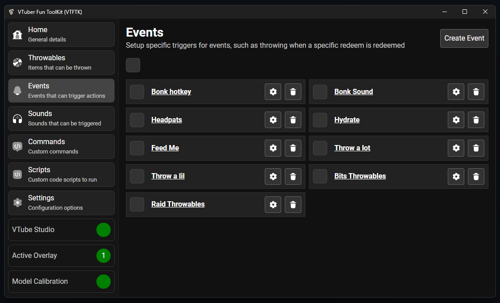

import { LinkCard } from "@astrojs/starlight/components";

Events provide a way to trigger things as a result of an "Event" such as 
- Redeems 
- Specific chat messages / commands
- Following
- Subscriptions
- Gifted Subscriptions
- Bits
- Raids

You can trigger the following actions when one of the above events occurs:
- Throw a throwable item (Barrage or single item)
- Trigger a VTube Studio hotkey 
- Play a sound

You can create your own custom reactions to any of these events using JavaScript 
by creating your own [Script](/guides/scripts/1-introduction) for more advanced behavior like taking advantage
of external APIs

<LinkCard
  title="Creating"
  description="Creating new events"
  href="/guides/events/2-creating"
/>

<LinkCard
  title="Testing"
  description="Test your events"
  href="/guides/events/3-testing"
/>

<LinkCard
  title="Examples"
  description="Examples for some common events"
  href="/examples/events/examples"
/>

