To create a event visit the "Events" section using the sidebar:

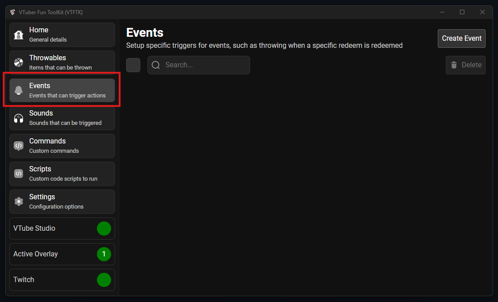

Then press "Create Event"

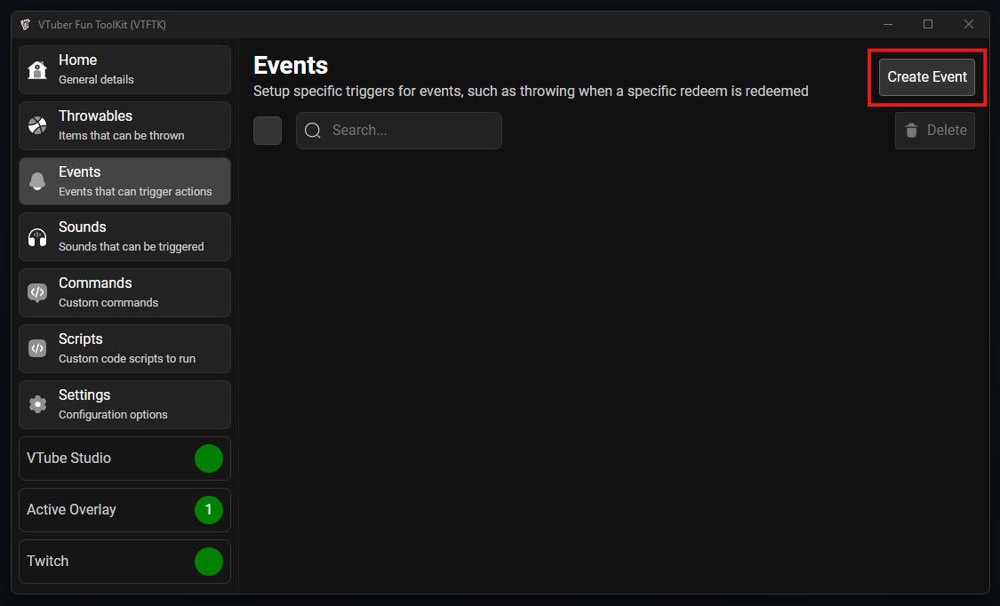

Provide a name for your event:

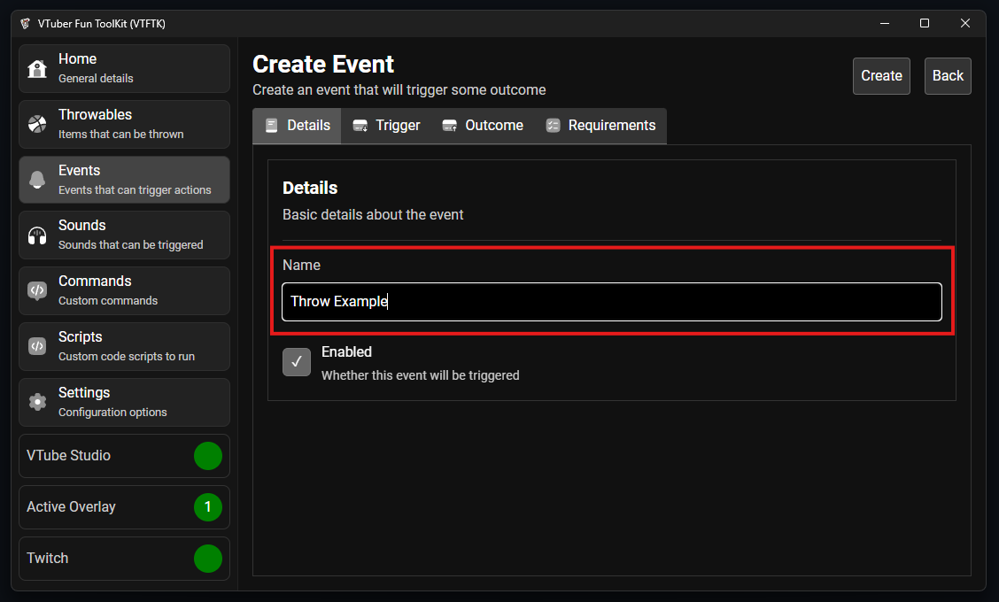

Select the "Trigger" tab, this will be the thing that we want our event to occur based on. In this example I am
creating a "Throw a lot" channel points redeem so I'll select the "Redeem" option

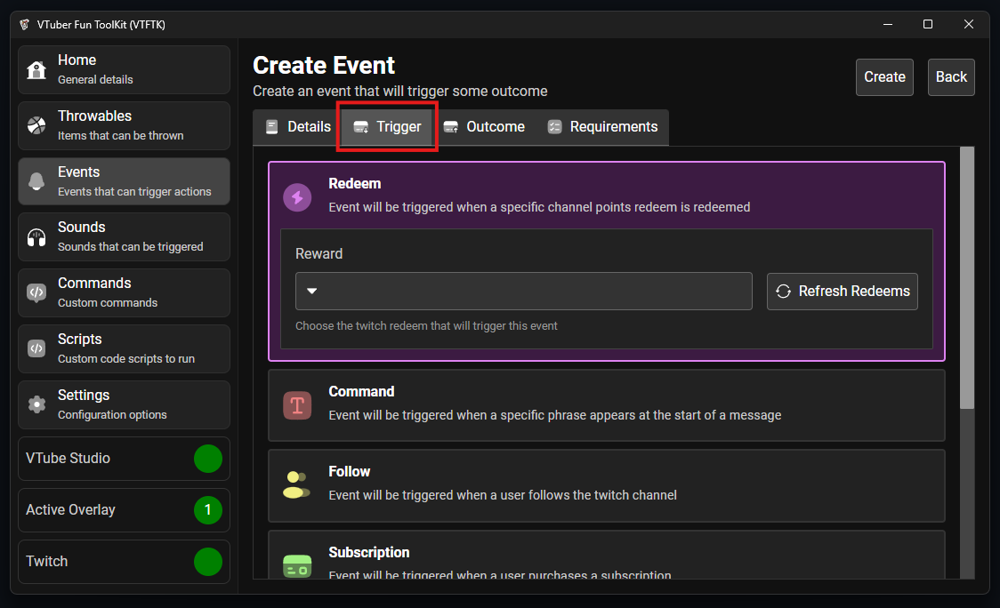

From the list of redeems I can then select the "Throw a lot" redeem which I've configured on Twitch in the "Custom Rewards" section of Twitch viewer rewards ([Here](https://dashboard.twitch.tv/u/pooksiam/viewer-rewards/channel-points/rewards) note this requires Twitch Affiliate)

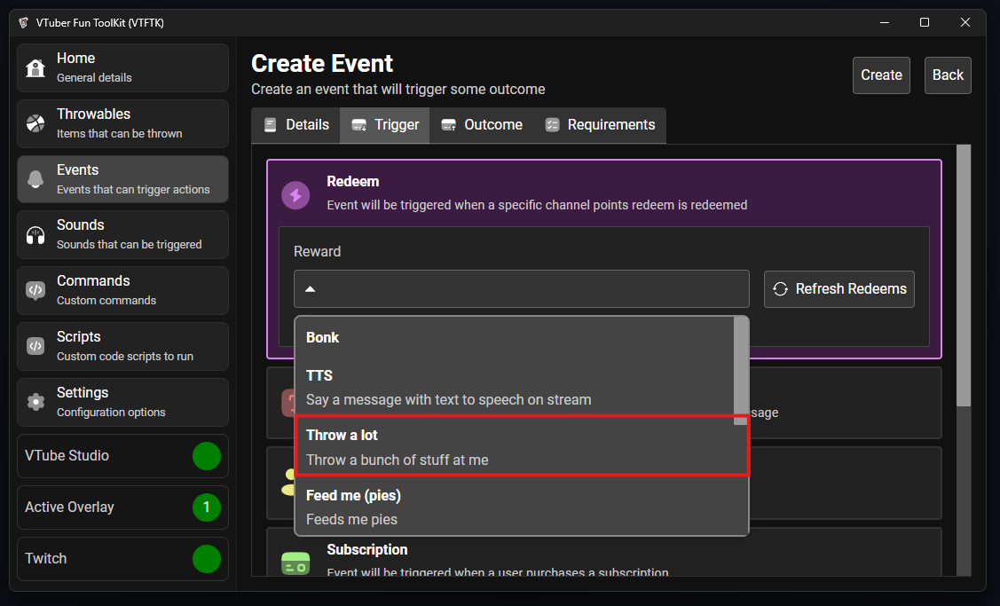

Now select the "Outcome" tab to choose what will happen when the event triggers:

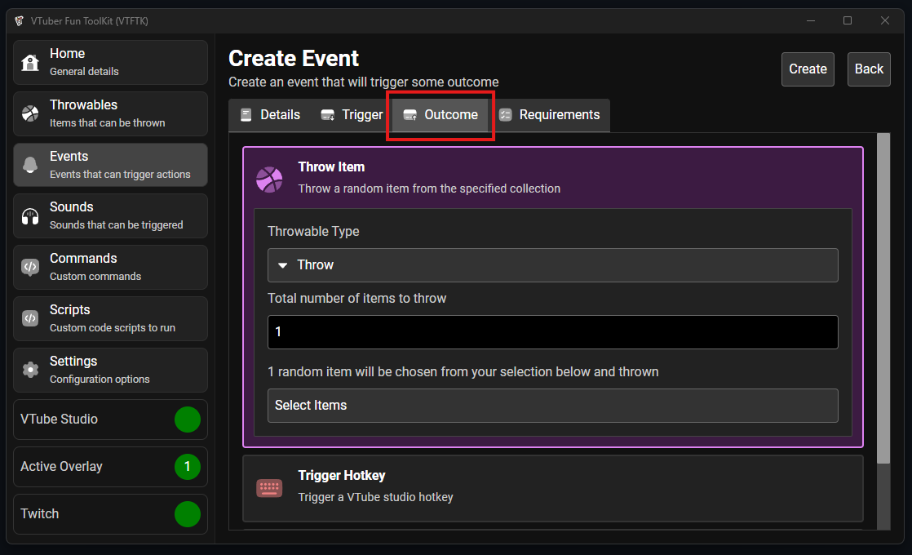

Here we are going to choose the "Throw Item" option and change the "Throwable Type" to "Barrage" to throw a lot of items:

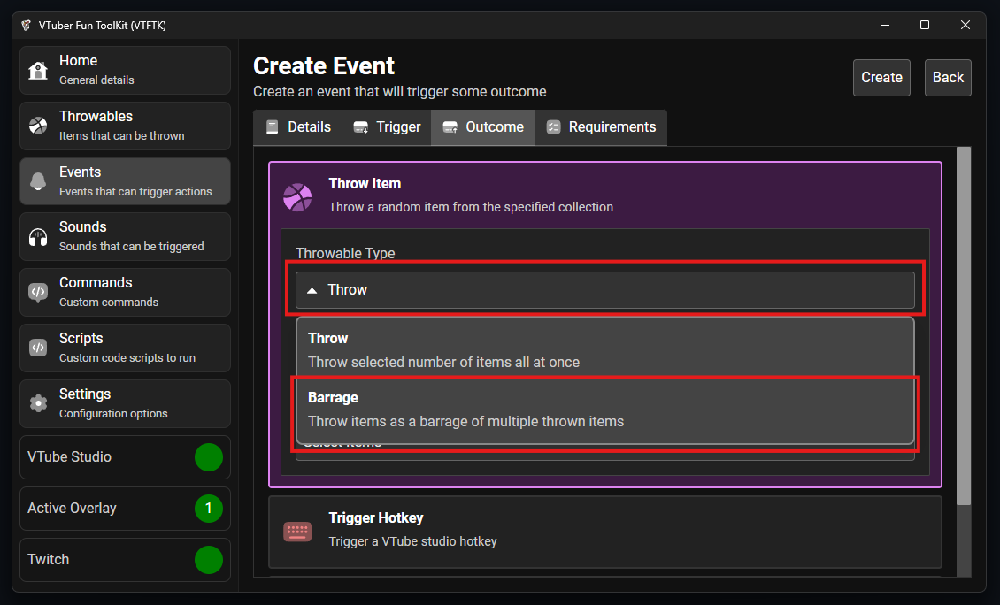

We can leave the amount options as the defaults then press the "Select Items" option to choose which items we want to throw:

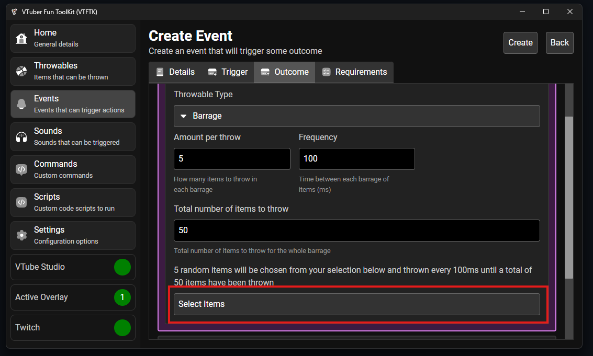

The "Select Items" dialog will appear, here you can choose which items you want to be thrown (For example you can select only specific items like water bottles for a hydrate redeem)

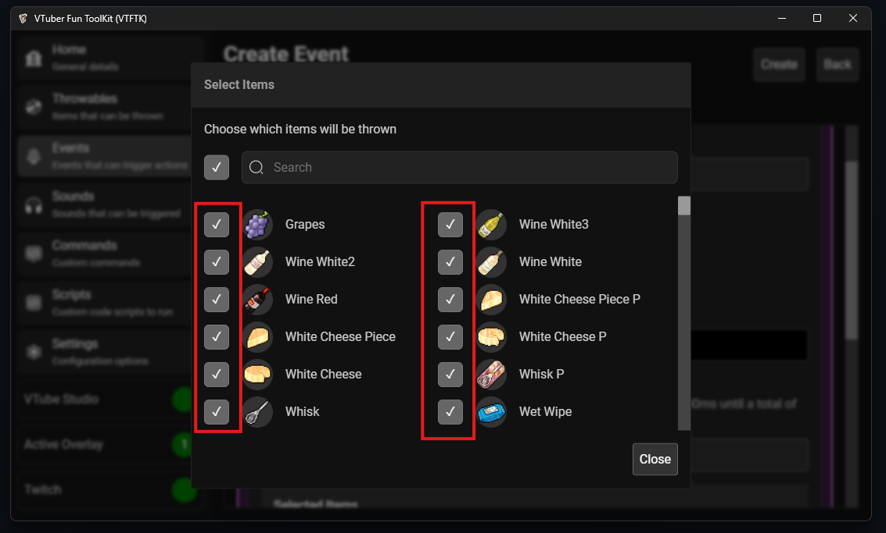

After you've selected the items you want to throw press "Close":

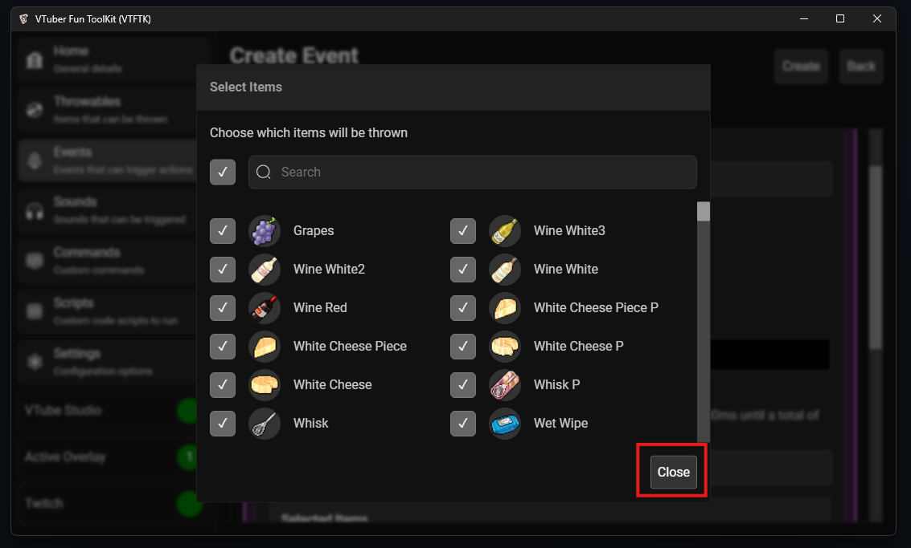

You will now see your selected items at the under the button:

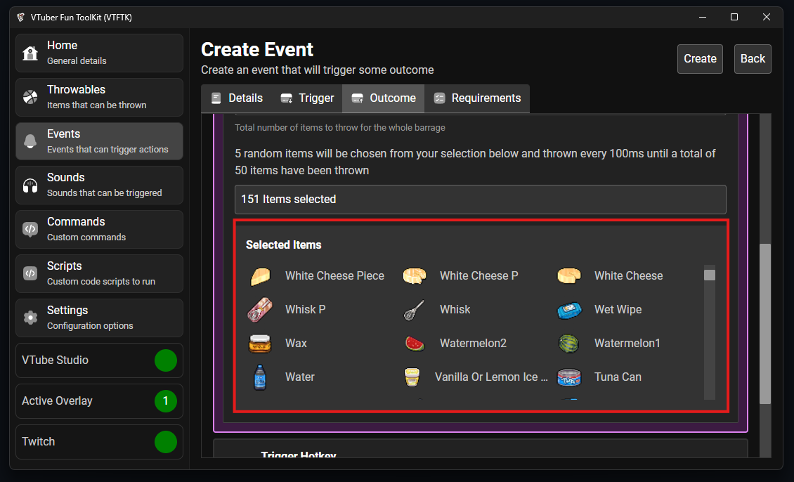

You can now head to the "Requirements" tab to configure things like the minimum required role 
and cooldowns (If you are using Twitch redeems you should configure the cooldowns on there instead)

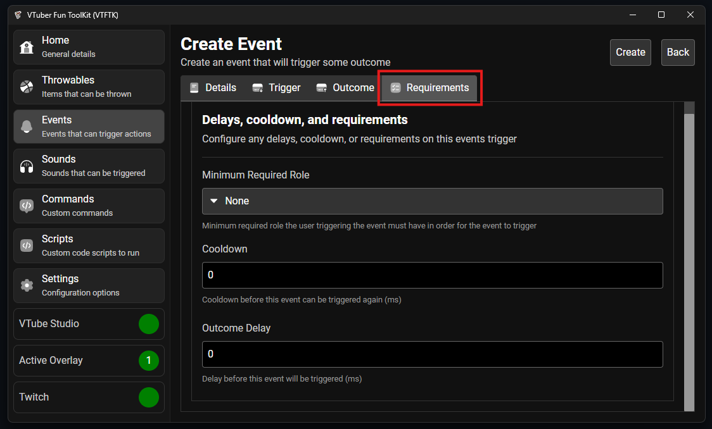

After you've configured the settings to your liking you can press the "Create" button to create the event

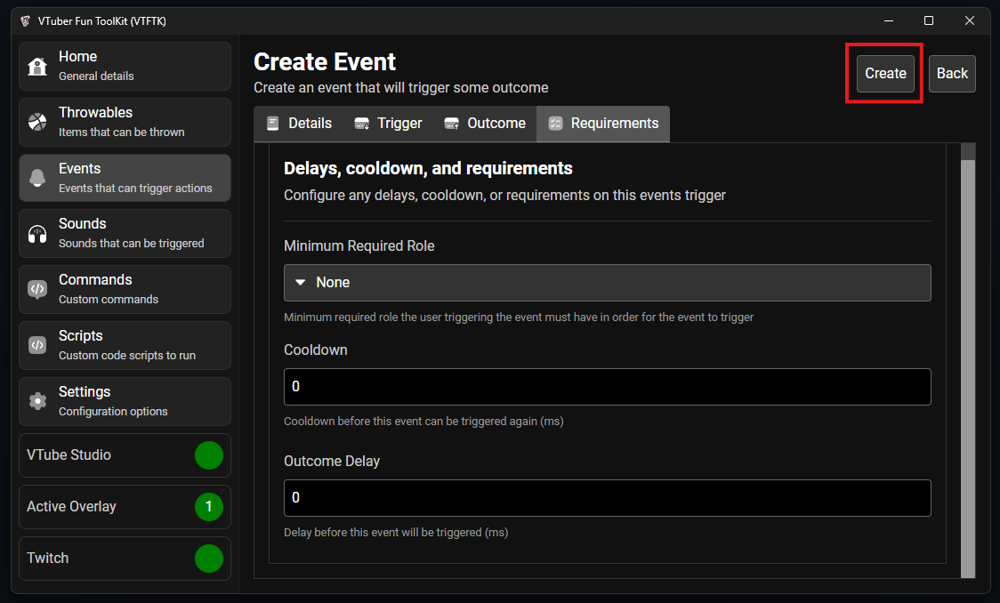

Your event will now be added to the list of events:

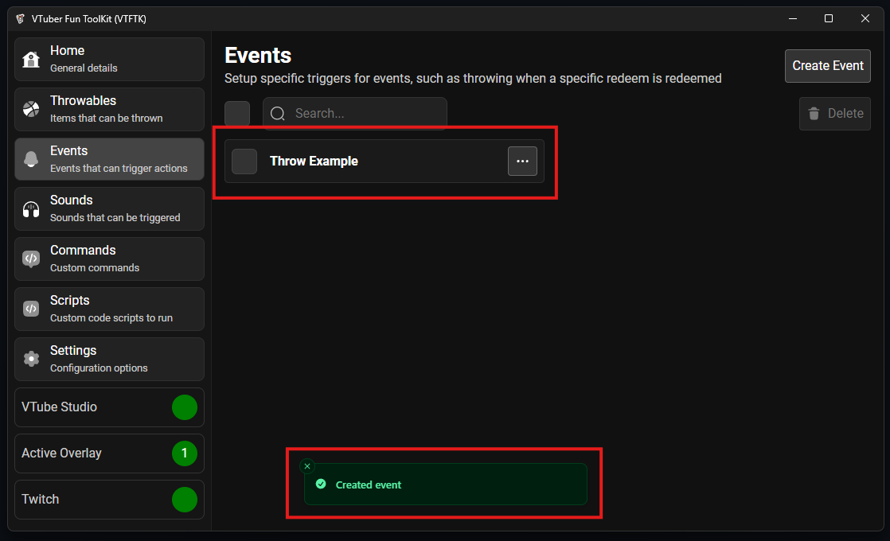