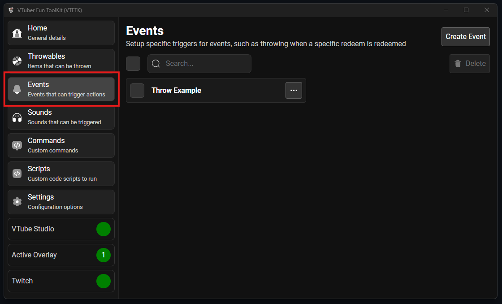
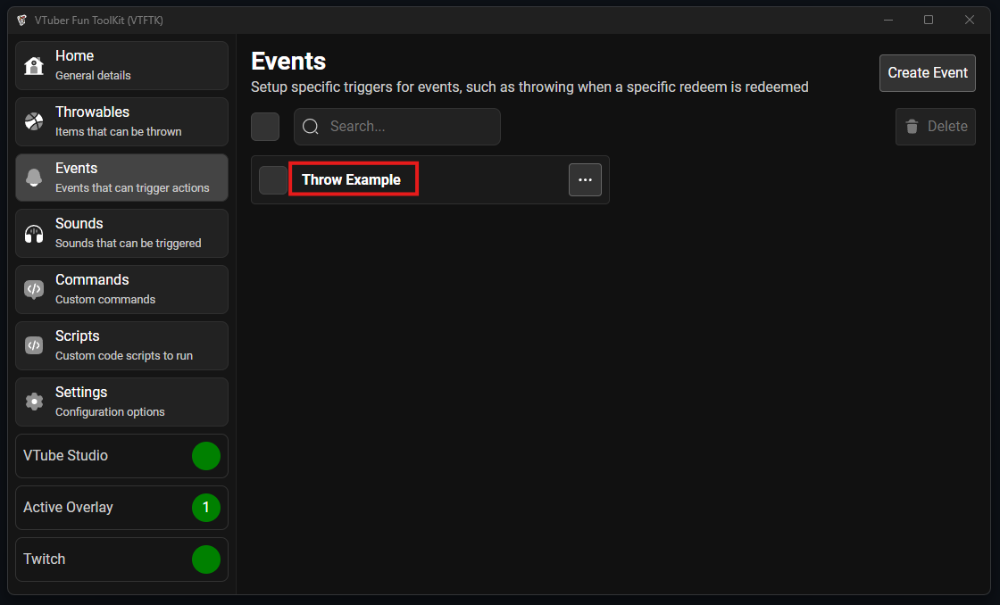
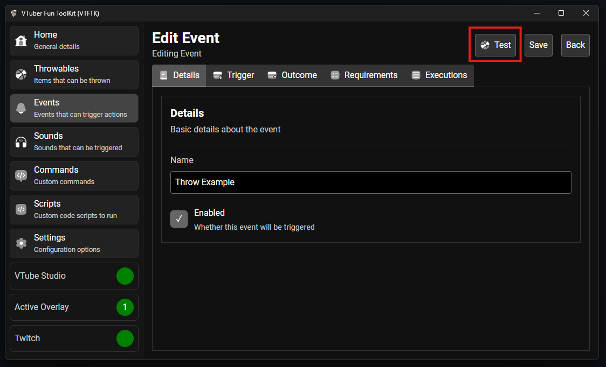

You can test your events without needing to make the actual thing happen

To do this go to the "Events" tab to view your events:

Then click the event you want to test:

Then press the "Test" button in the top right, this will test the event.

Ensure an overlay is connected or testing will not work. Ensure you are also 
connected to VTube Studio for any events the trigger things like throwables
or VTube Studio hotkeys