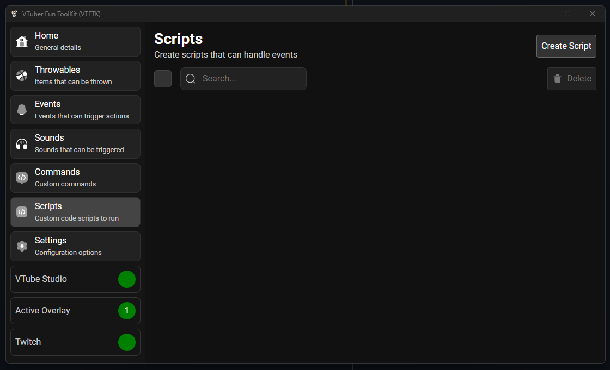

import { LinkCard } from "@astrojs/starlight/components";

Scripts provide a way to run some JavaScript code when something happens on twitch. You 
can react to the following twitch events:

- chat
- cheering bits
- follows
- gifted subscriptions
- resubscription
- redeems
- subscriptions
- raid

<LinkCard
  title="Creating"
  description="Creating a script"
  href="/guides/scripts/2-creating"
/>

<LinkCard
  title="Examples"
  description="Examples for some common and useful commands"
  href="/examples/scripts/examples"
/>

