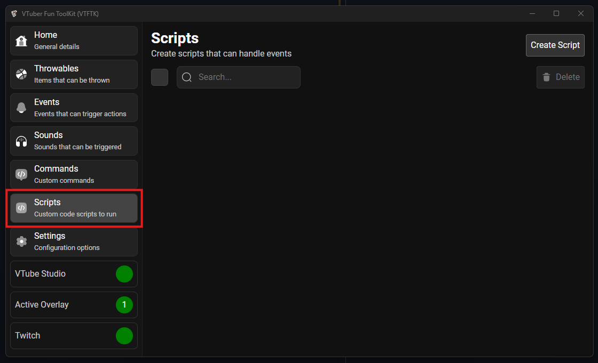
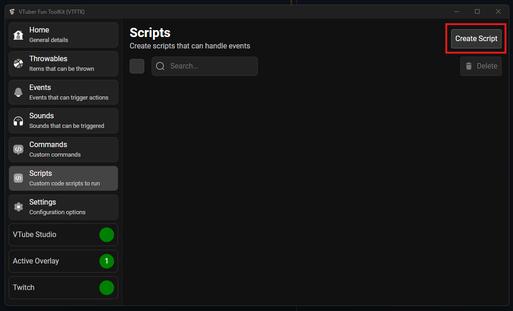
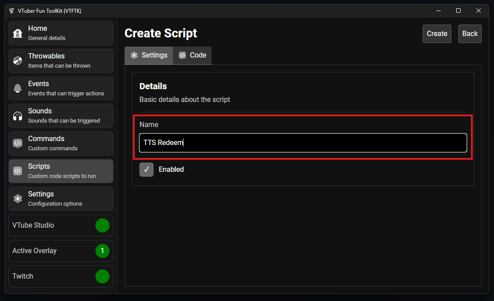
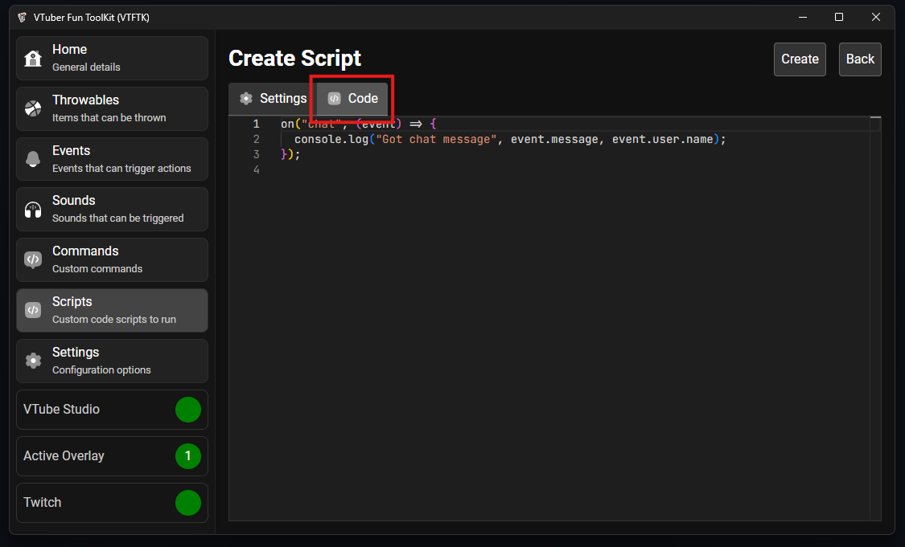
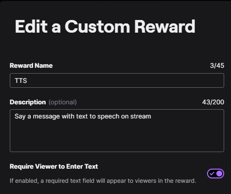
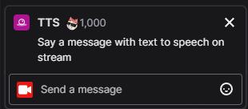
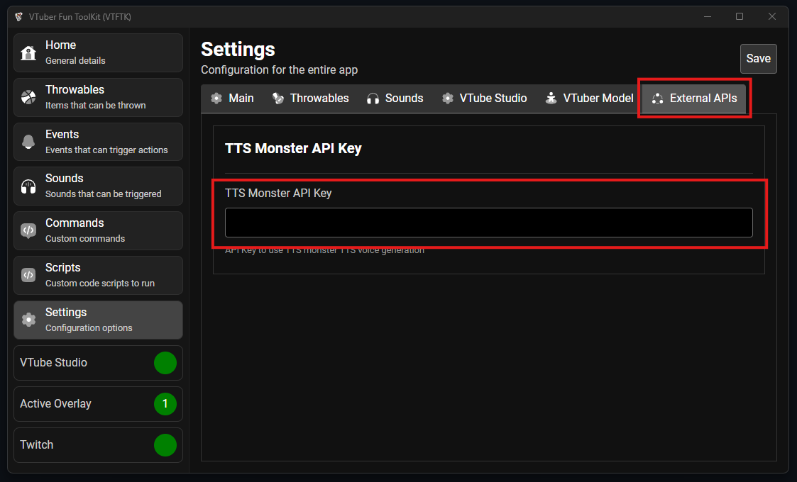
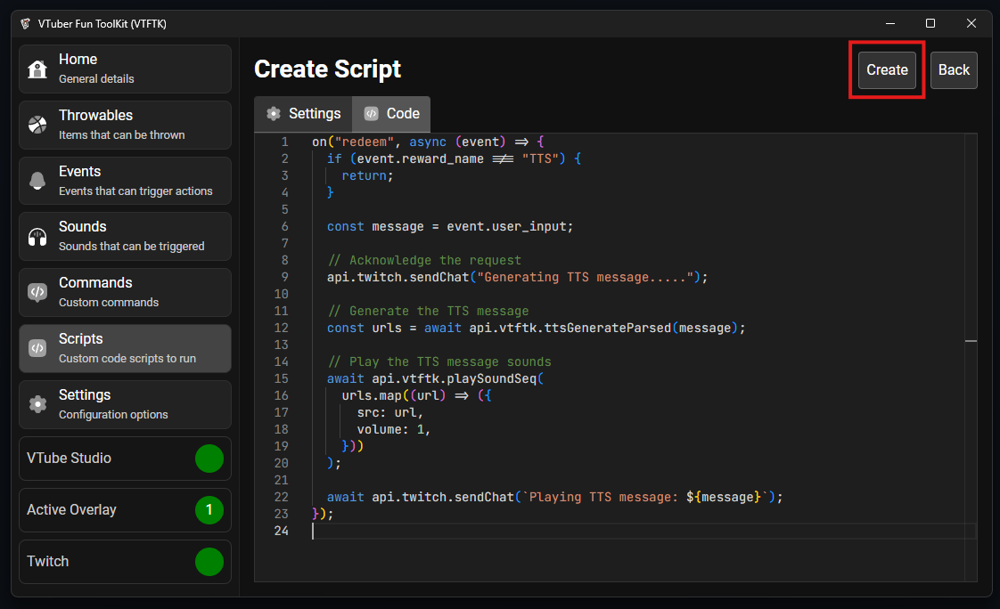
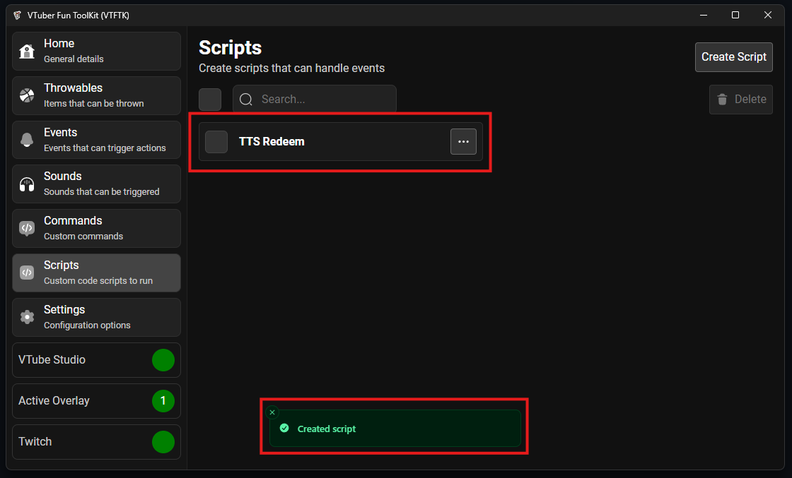

To create a script navigate to the "Scripts" tab using the sidebar:



Then press "Create Script"



Provide a name for your script, in this case I will be creating a TTS redeem:



Visit the "Code" tab to start writing the script code:



We will use the following code:

```js
on("redeem", async (event) => {
  if (event.reward_name !== "TTS") {
    return;
  }

  const message = event.user_input;

  // Acknowledge the request
  api.twitch.sendChat("Generating TTS message.....");

  // Generate the TTS message
  const urls = await api.vtftk.ttsGenerateParsed(message);

  // Play the TTS message sounds
  await api.vtftk.playSoundSeq(
    urls.map((url) => ({
      src: url,
      volume: 1,
    }))
  );

  await api.twitch.sendChat(`Playing TTS message: ${message}`);
});
```

The script above relies on a "Custom Reward" configured in Twitch named "TTS" 



when this reward is redeemed it uses the TTS Monster integration to read out the user provided message:



> Ensure you set your TTS Monster API key in the **VTFTK** settings for this script to work
>
> 

After you've added the code press the "Create" button to create your script



You will now see your script at the top of the list:

