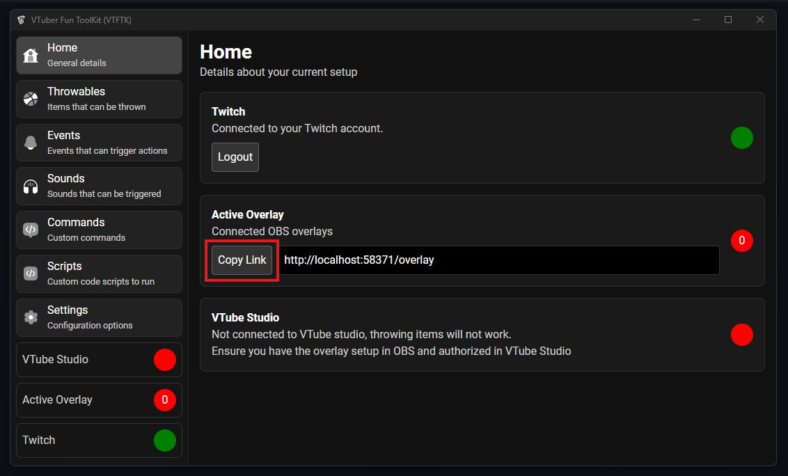
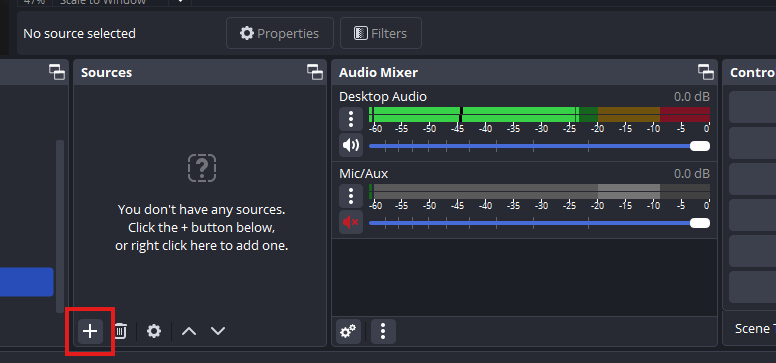
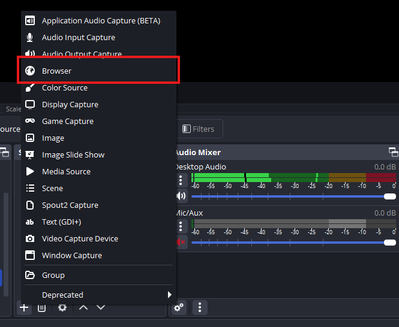
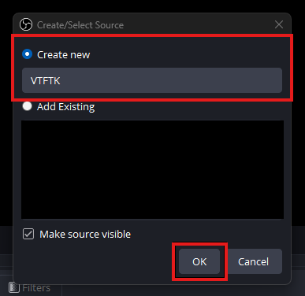
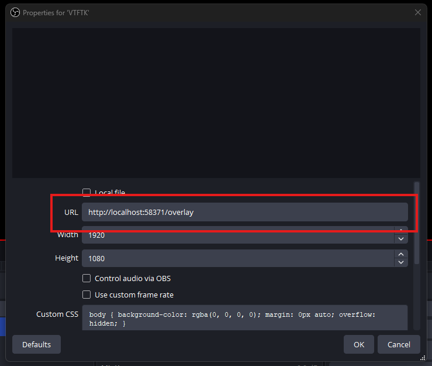
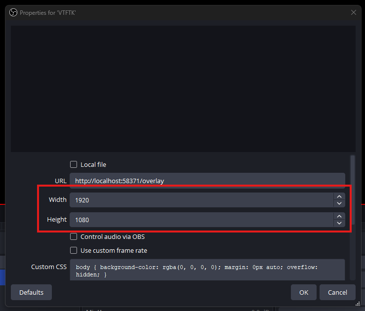
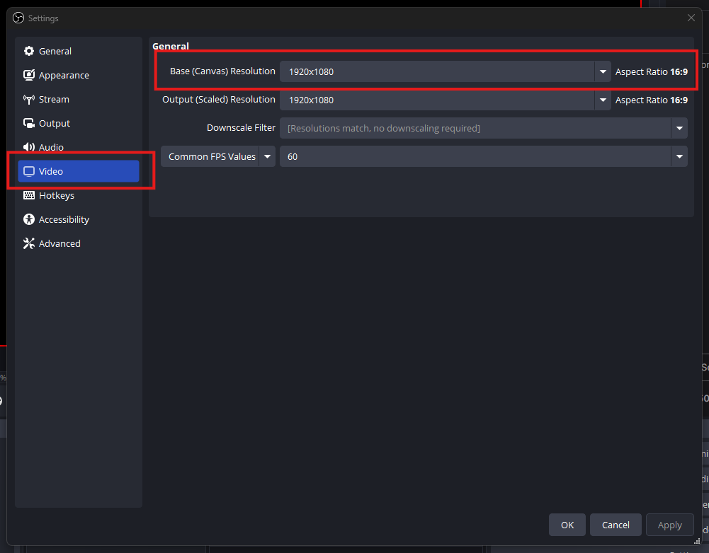
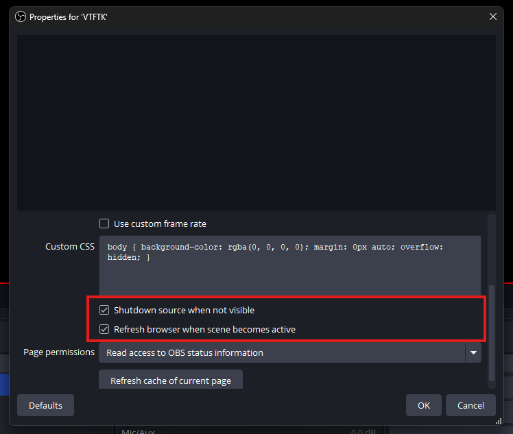

The OBS overlay is required to play sounds and for seeing the thrown items. The guide below shows you how 
to connect it.

Open **VTFTK** and visit the "Home" tab, in the "Active Overlay" section press the "Copy Link" button or manually copy the URL.

This is the link to the overlay to add to OBS

Open OBS, go to the "Sources" section on your screen and push the "+" button:

From the menu that pops up press the "Browser" option

After clicking browser select the "Create new" option then press "OK"

Paste the URL copied from the previous step into the "URL" box 

Ensure you "Width" and "Height" match your OBS "Base (Canvas) Resolution". You can find this in your OBS settings under the "Video" tab:

You can optionally enable "Shutdown source when not visible" and "Refresh browser when scene becomes active" 

"Shutdown source when not visible" will allow you to save resources by hiding the overlay browser when you hide it or are on a different scene that doesn't have it

