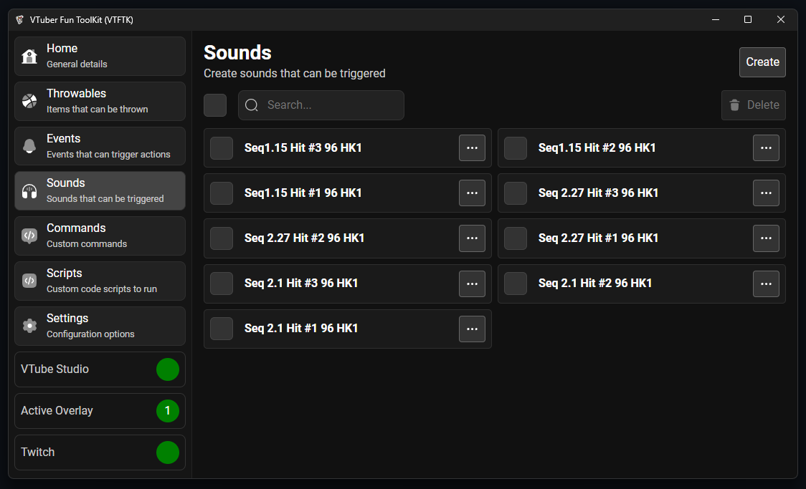

import { LinkCard } from "@astrojs/starlight/components";

Sounds are audio clips that can be played both on their own as the result of an event or 
as the impact sound for thrown items.

<LinkCard
  title="Creating"
  description="Creating new sound"
  href="/guides/sounds/2-creating"
/>

<LinkCard
  title="Bulk Creating"
  description="Creating many sounds in bulk from a collection of audio files"
  href="/guides/sounds/3-bulk-create"
/>