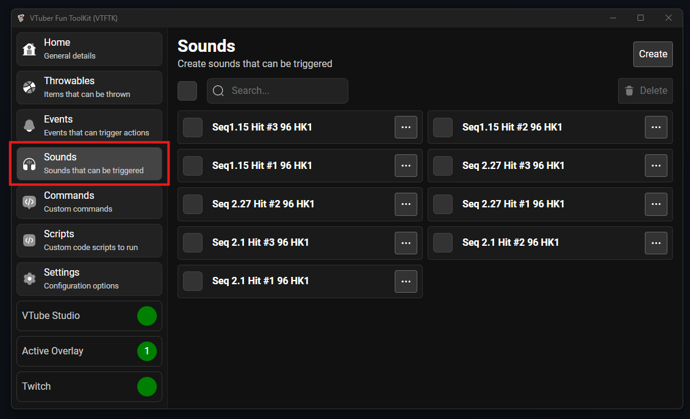
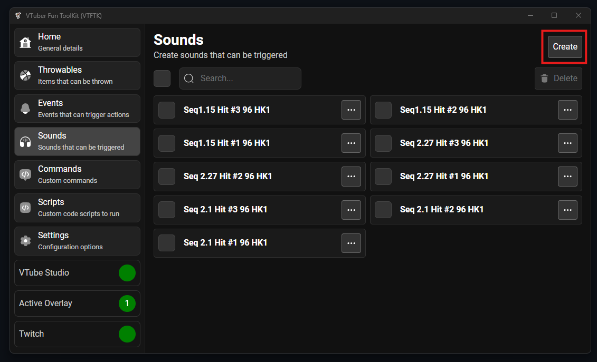
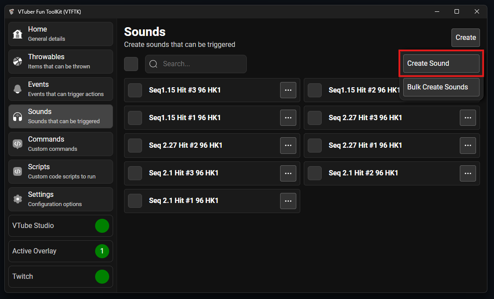
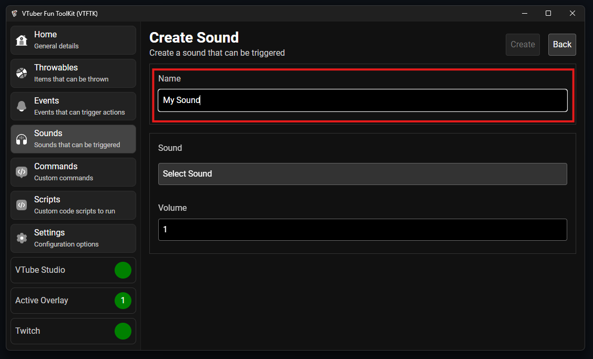
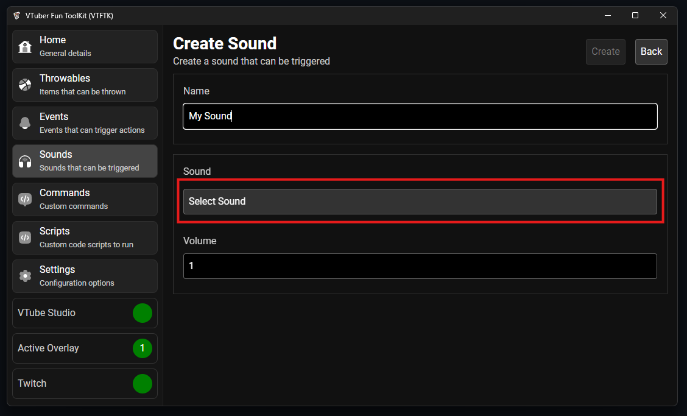
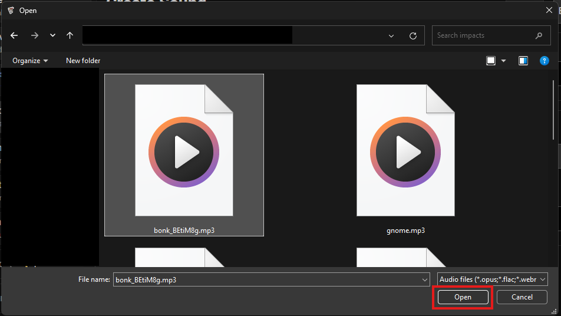
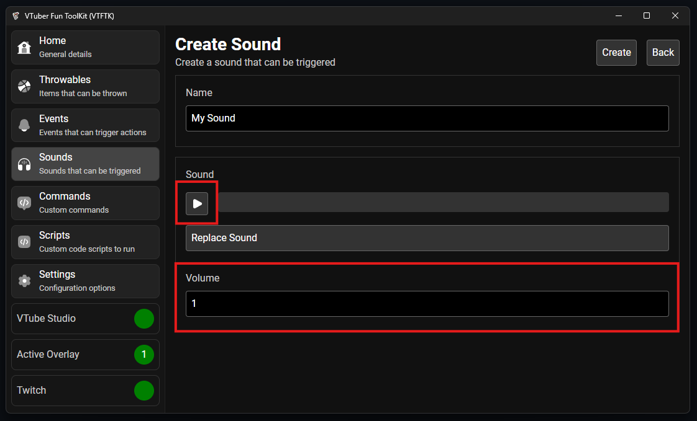
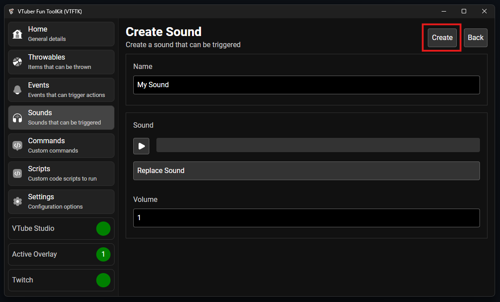
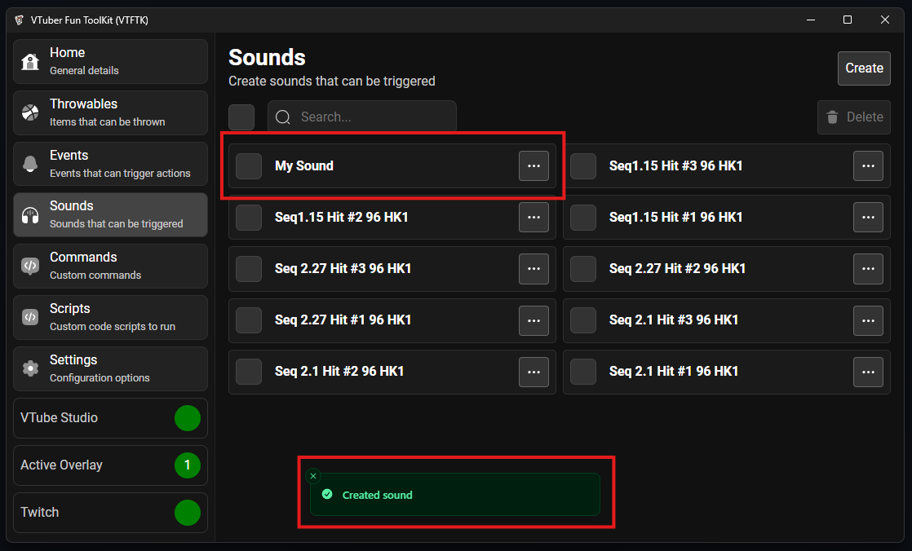

To create your own sound visit the "Sounds" section using the sidebar:

Then press the "Create" button:

Then press "Create Sound":

    

Give your new sound a name:

Press "Select Sound" button to choose the sound file:

In the file picker that opens up navigate to and select your sound file then push "Open":

    

You can now use the play button to test the audio and adjust the "Volume" accordingly to
get the volume level for the sound right:

After you've configured the volume and tested the sound, press the "Create" button to create
the sound:

You will return to your list of sounds and the new sound will be at the top of the list, you can 
now connect this sound to throwables or events:

