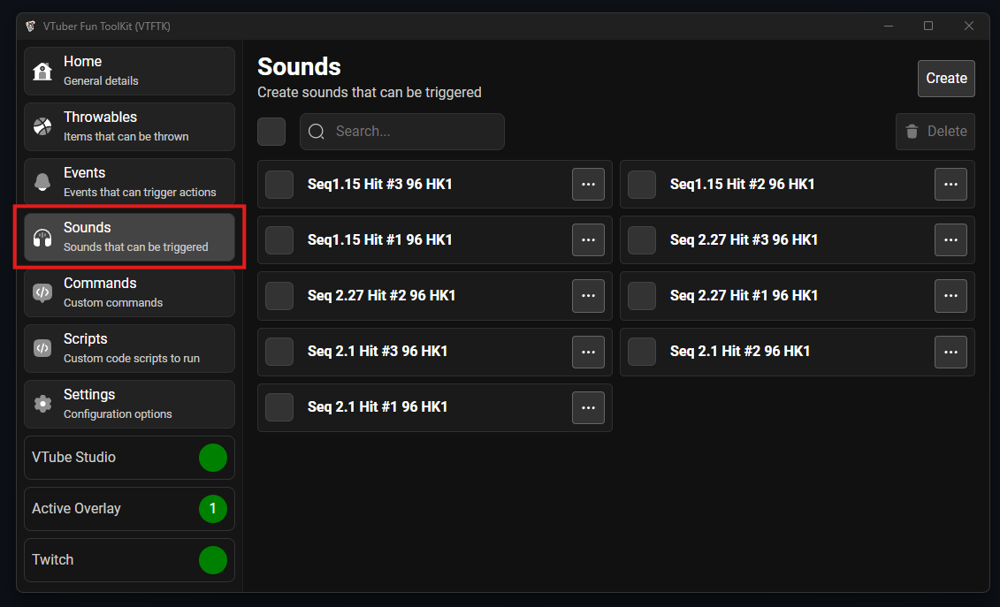
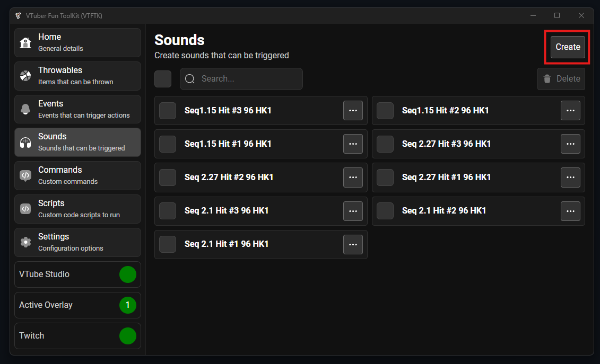
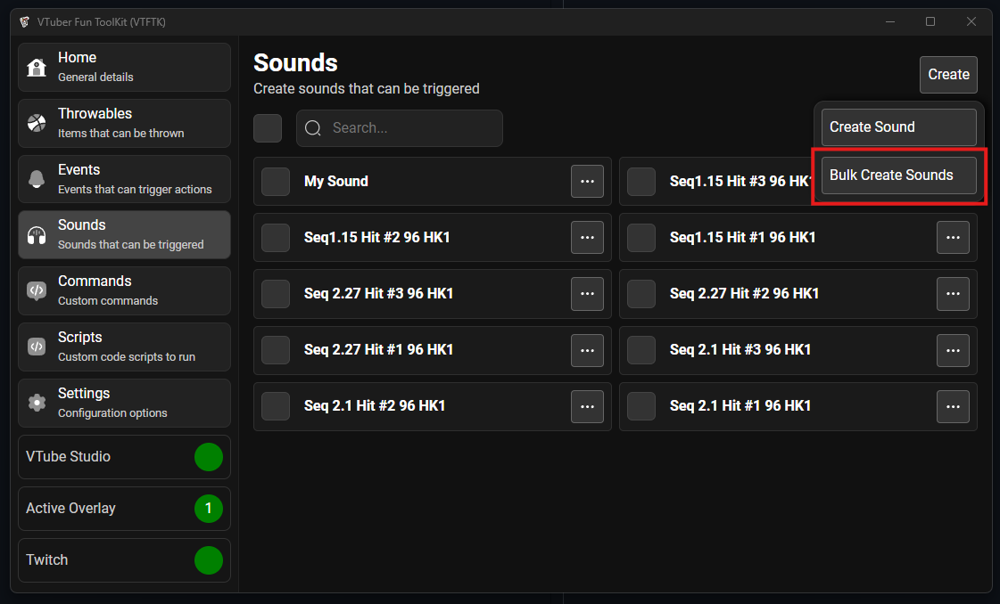
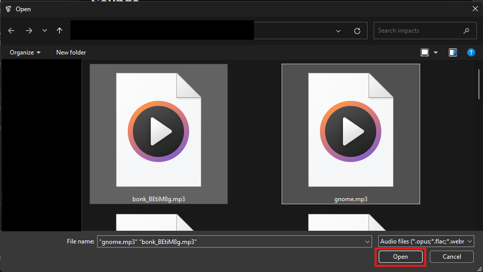
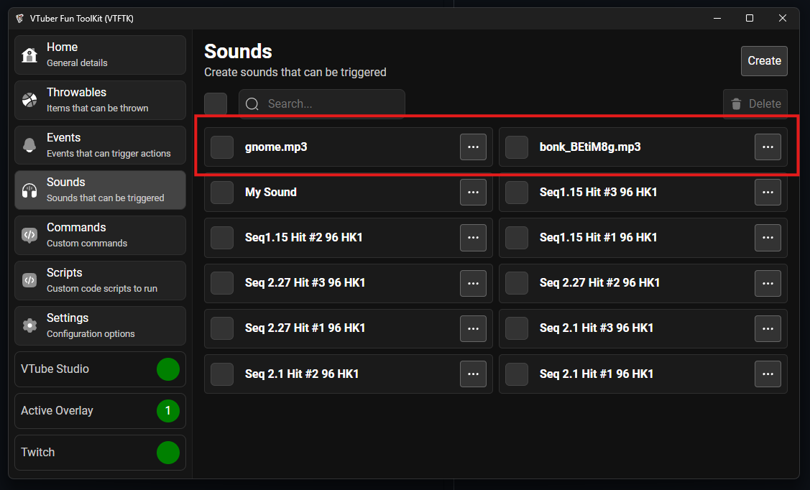

You can create sounds in bulk then configure them individually later using "Bulk Create Sounds"

To create your own sound visit the "Sounds" section using the sidebar:

Then press the "Create" button:

Then press "Bulk Create Sounds"

In the file picker that opens select the sound files you want to create sounds from then press "Open"

Your new sounds will be added the the top of the list and you can now configure them individually:

