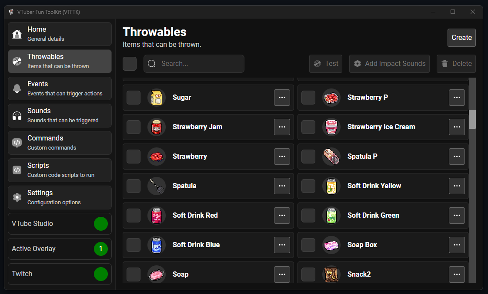

import { LinkCard } from "@astrojs/starlight/components";

> Throwables are items that can be thrown at your VTube model.

Provided with **VTFTK** is a collection of super market themed items like food and drinks. These come from the [Pixel Mart](https://ghostpixxells.itch.io/pixel-mart)
game assets collection. These assets are free to use with commercial use allowed so you are free to use them as much as you like.

<LinkCard
  title="Creating"
  description="Creating new throwable items from your own images"
  href="/guides/throwables/2-creating"
/>

<LinkCard
  title="Bulk Creating"
  description="Creating many throwables in bulk from a collection of images"
  href="/guides/throwables/3-bulk-create"
/>

<LinkCard
  title="Testing"
  description="Test your throwables"
  href="/guides/throwables/4-testing"
/>

