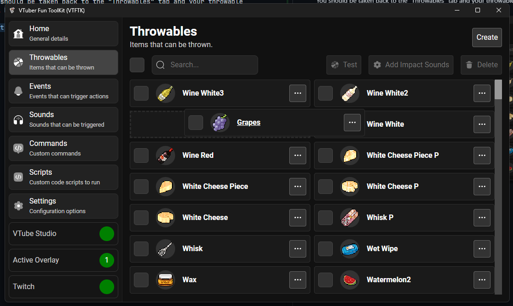

To create your own throwable visit the "Throwables" section using the sidebar:

Then press the "Create" button 

Then "Create Throwable"

## Choose Image

Press the "Select Image" button

Find the image you want to use within the file picker that appears and press "Open"

You will now see a preview of your chosen image below, adjust the "Scale" of the image to your desired scale (You can change this later after testing it with your model)

Adjust the "Scale" of the image to your desired scale. Note the actual scale will depend on the scale of you VTuber model, you can adjust this option later after testing it against your model.

Ensure you enable the "Pixelate" option if your image is pixel art (Like the image is below) for the best looking image 

## Enter Details

Navigate to the "Details" tab and enter in the name for your throwable.

## Choose Impact Sounds

> Impact sounds are the sounds that will be played when the item hits your VTuber model. You can have any number of impact sounds here and they will be randomly chosen from on impact
>
> See the [Create Sound](../sounds/2-creating) guide for adding your own custom sounds

Next navigate to the "Impact Sounds" tab. 

Then press the "Select Sounds" button:

This will open the sound picker dialog, here you can check the checkboxes for the sounds you'd like to play on impact

Theres a number of built in sounds available

Select the checkboxes on the left for the sounds you'd like to use. Check the first checkbox to select all sounds

After you've selected your sounds push the "Done" button

After pressing add you should see the sound names appear under "Selected Sounds"

Finally you can press the "Create" button to create your throwable

You should be taken back to the "Throwables" tab and your throwable will be at the top of the list

You can drag and drop your throwables to order them the way you'd like

Visit the [Testing](/guides/throwables/4-testing) section to see how to test your throwables