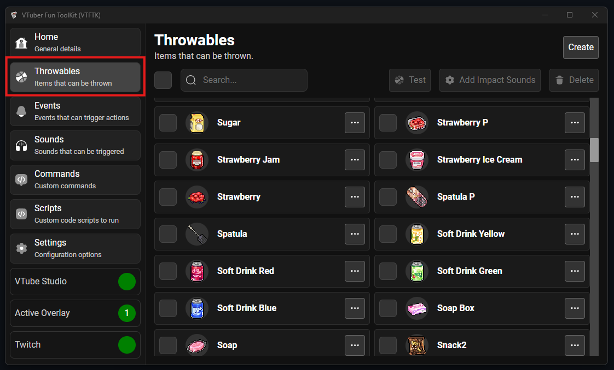
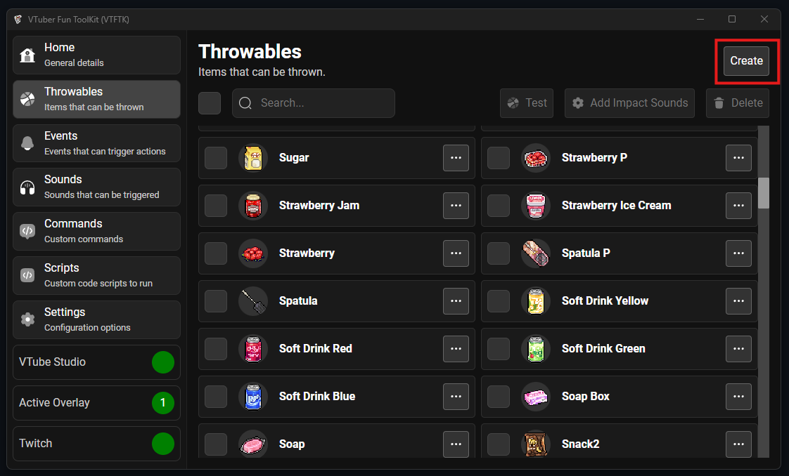
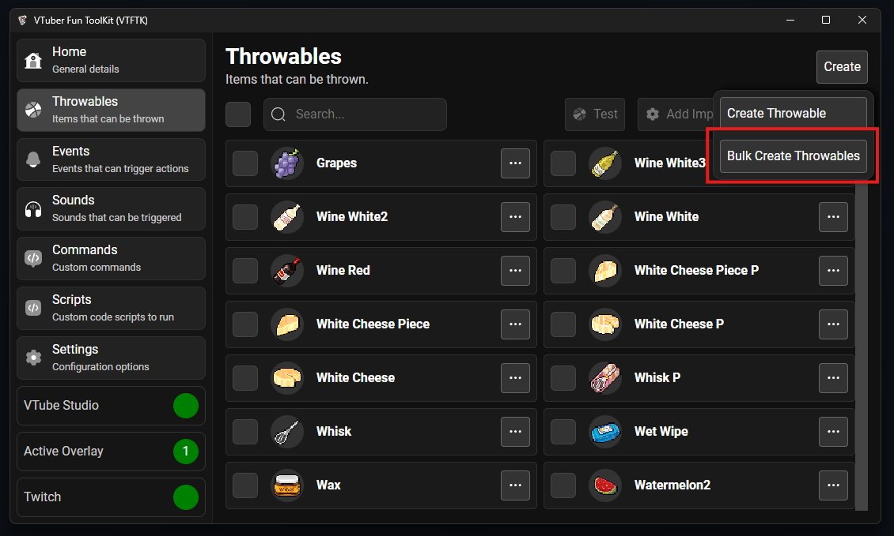
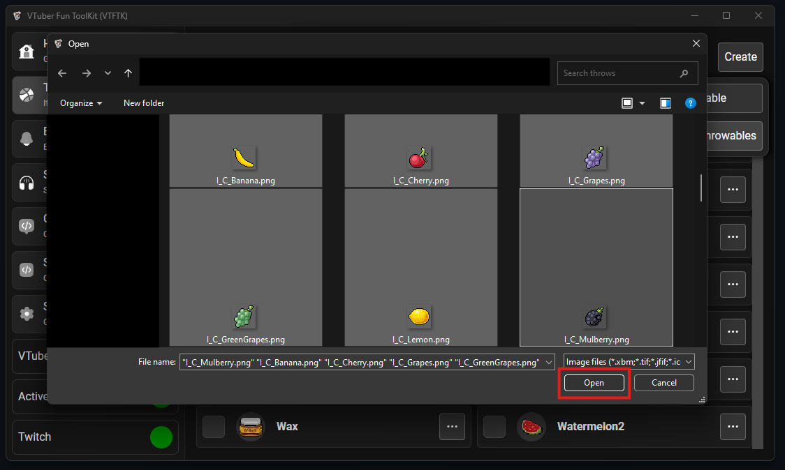
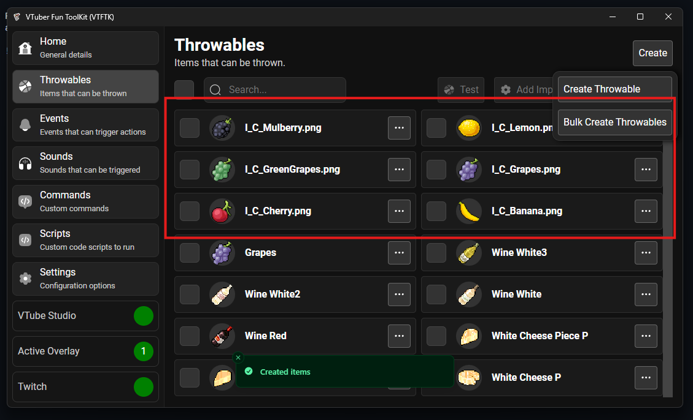
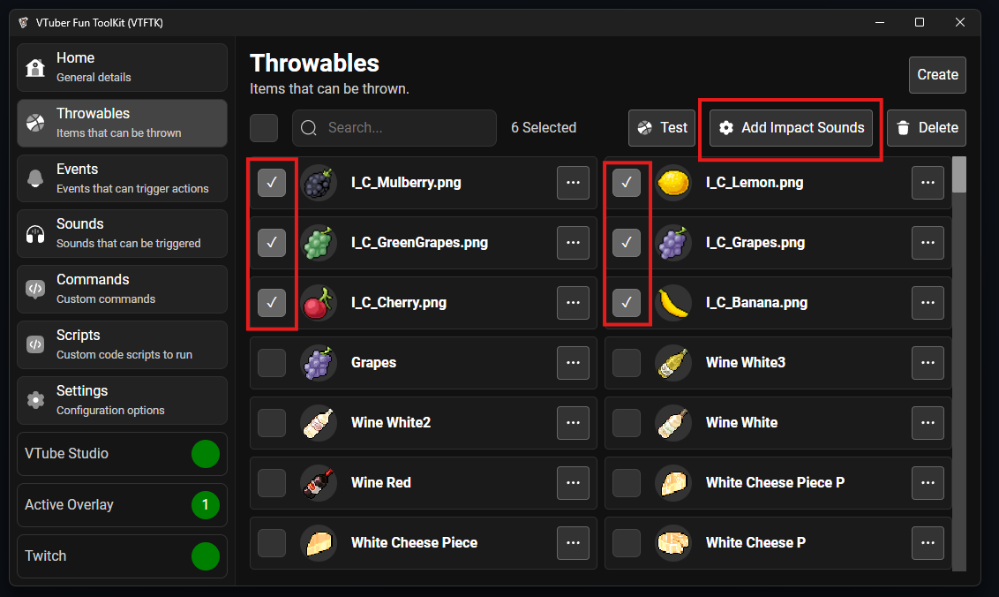
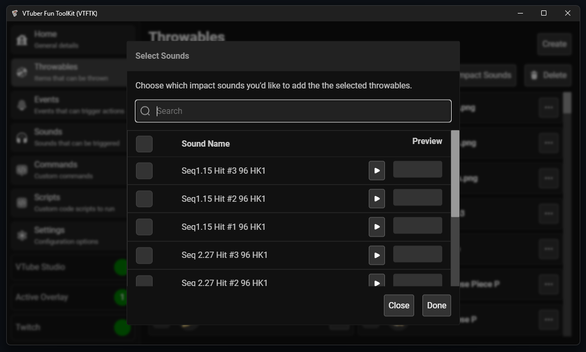
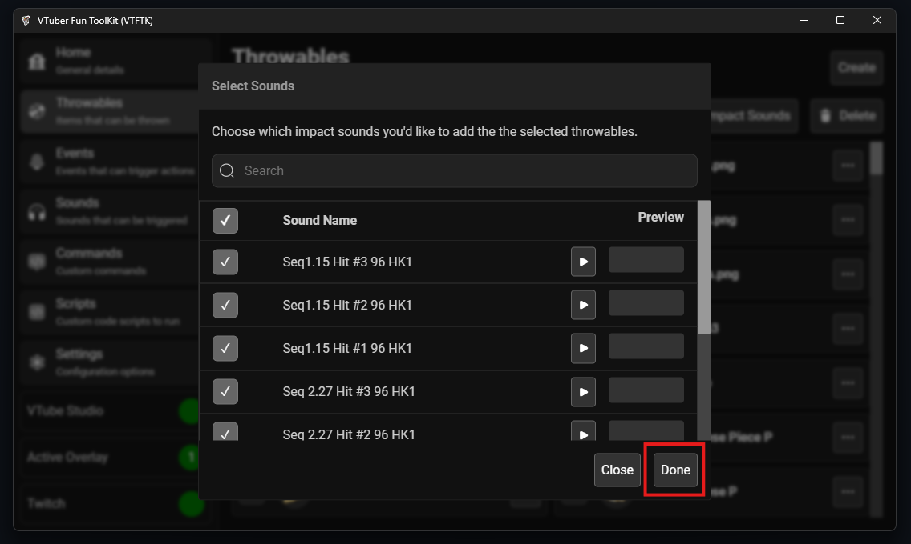
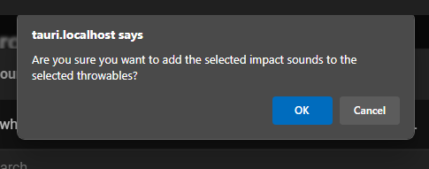
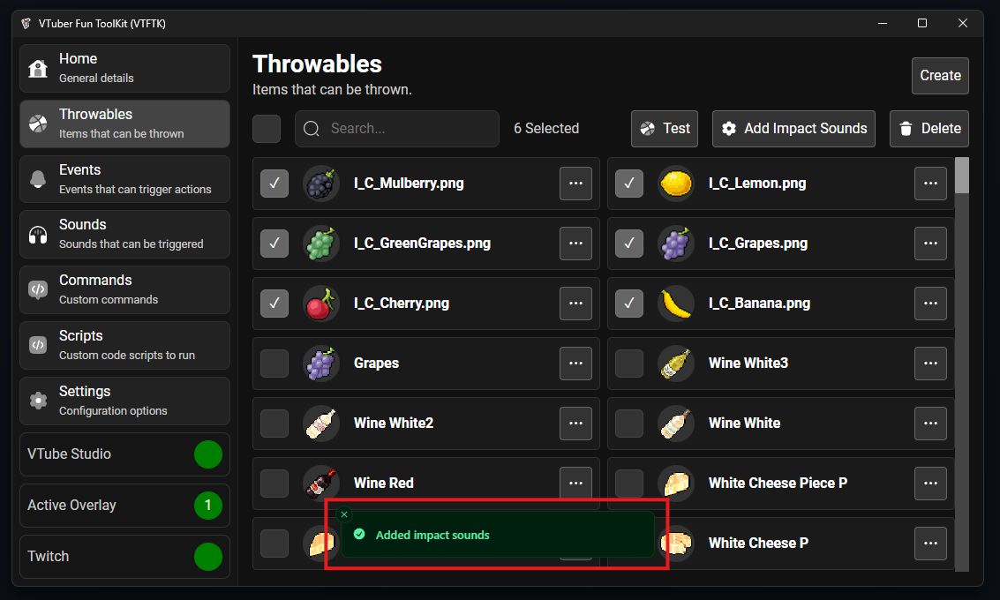

You can create throwables in bulk then configure them individually later using "Bulk Create Throwables"

To create your own throwables in bulk visit the "Throwables" section using the sidebar:

Then press the "Create" button 

Then press "Bulk Create Throwables"

From the file picker that opens, select all the image files that you want to turn into throwables
and press "Open"

The images you selected will be created as throwables using default settings

By default these throwables will not have any impact sounds, to fix this and add impact sounds to all of them,
select the throwables you've added using their checkbox and push the "Add Impact Sounds" button

This will open the sound picker dialog, choose the sounds you'd like to add

After you've chosen the sounds you'd like, press the "Done" button

You will be prompted to confirm adding the sounds push "OK"

You will see a popup notifying you that the sounds were added

Visit the [Testing](/guides/throwables/4-testing) section to see how to test your throwables