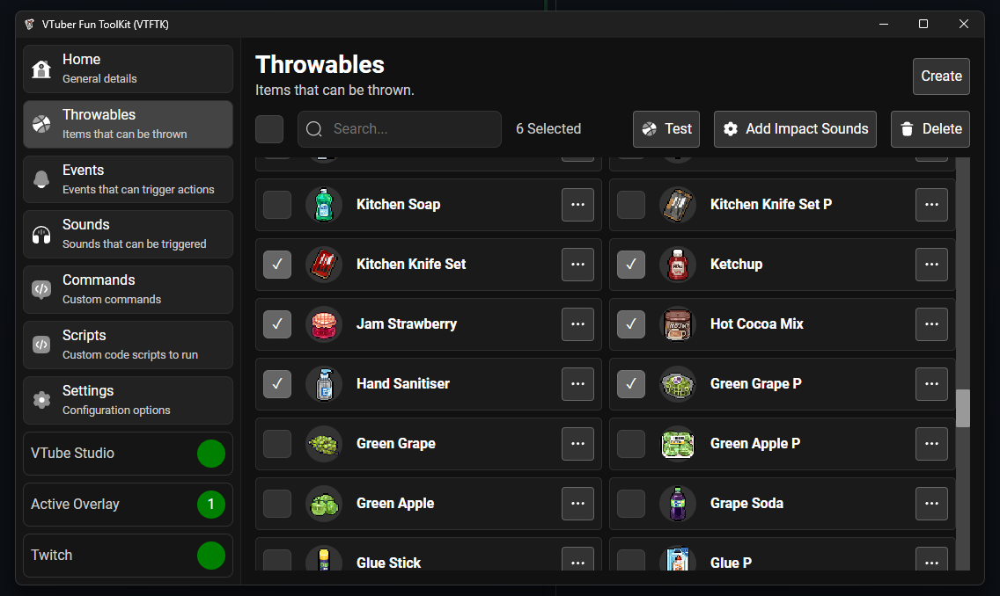

## Testing Individual

To test an individual throwable first click the name of the throwable

This will take you to the edit page for the throwable. From this page you can press "Test" or "Test Barrage" to test your throwable

- "Test" will throw just one item
- "Test Barrage" will throw a barrage of the item multiple times

## Testing Many

You can test from a selection of many items at once. First navigate to the throwables list and select the items you'd like to test

Then press the "Test" button and either "Test One" or "Test Barrage"

- "Test One" randomly throw one of the selected items
- "Test Barrage" throw a barrage of items randomly chosen from the selection

