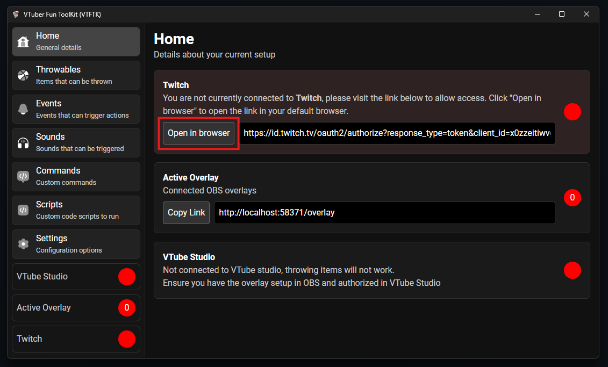
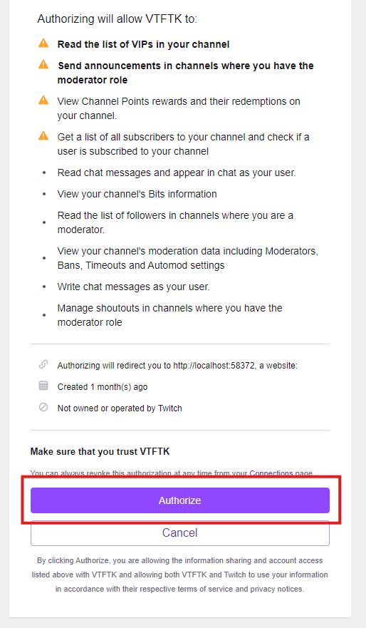
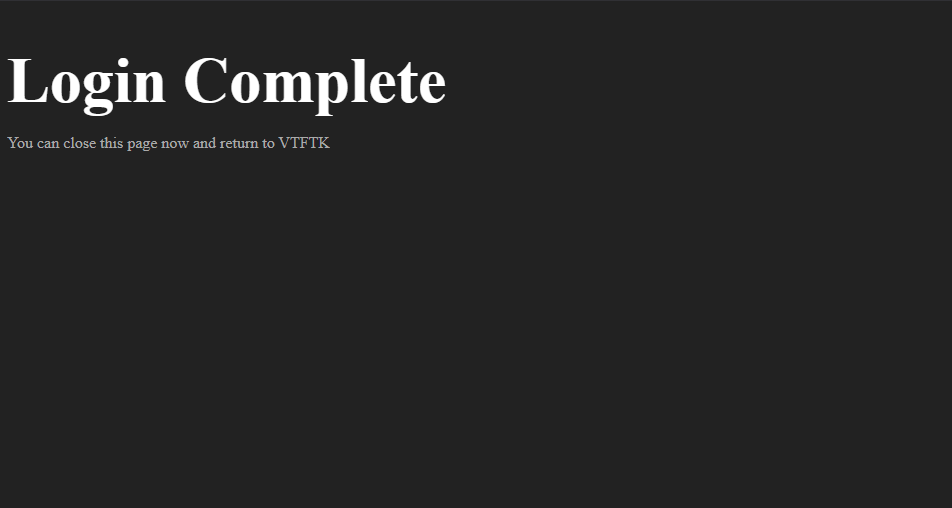
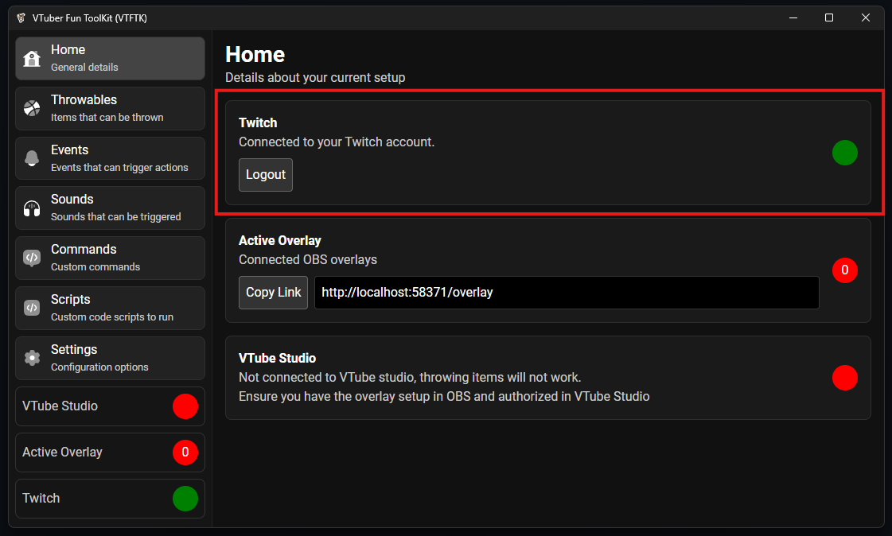

You must connect **VTFTK** to your twitch in order for the app to be able to read chat messages and listen for redeems.

Open **VTFTK** and visit the "Home" tab, there will be a "Open in Browser" button, click this 

This will open a twitch authorization prompt in your browser (You may be asked to login to twitch before you see the prompt)

Press "Authorize" to allow **VTFTK** access to the required twitch features.

After pressing authorize you will be taken to a page like the following that will say "Completing Login" momentarily. 

Once the page says "Login Complete" you can close the site and go back to the **VTFTK** app

Within the app you should see that the status for "Twitch" is now green

You can now move onto the next step