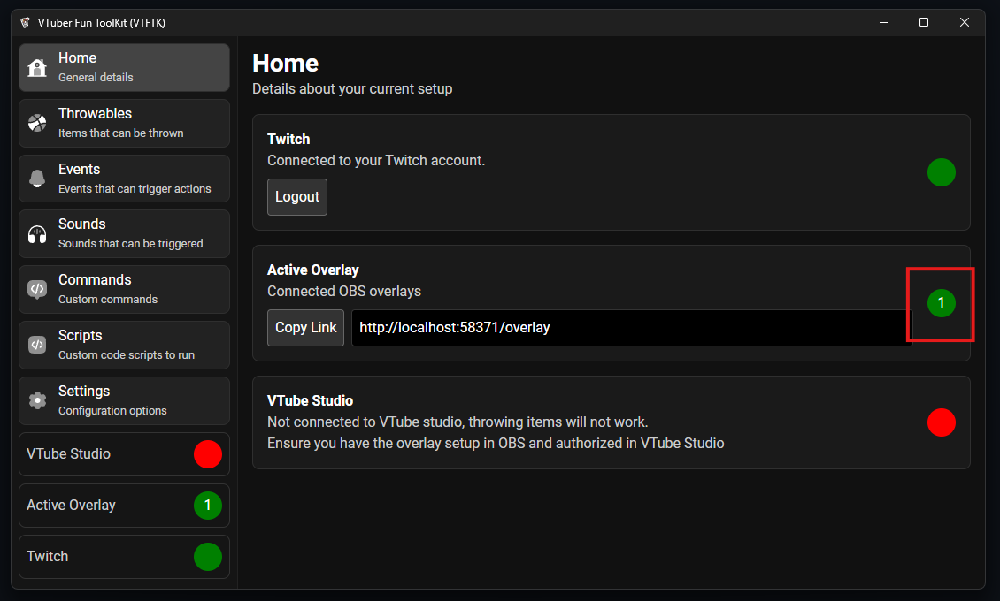
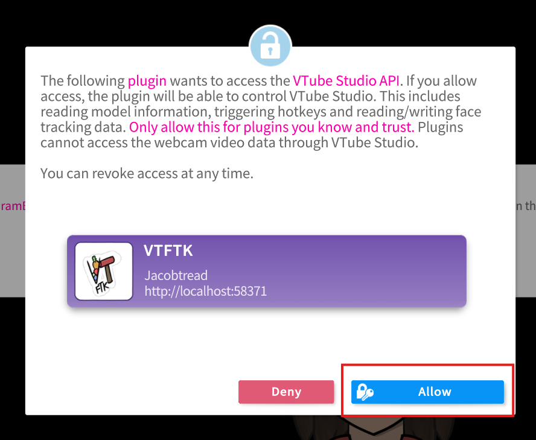
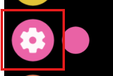
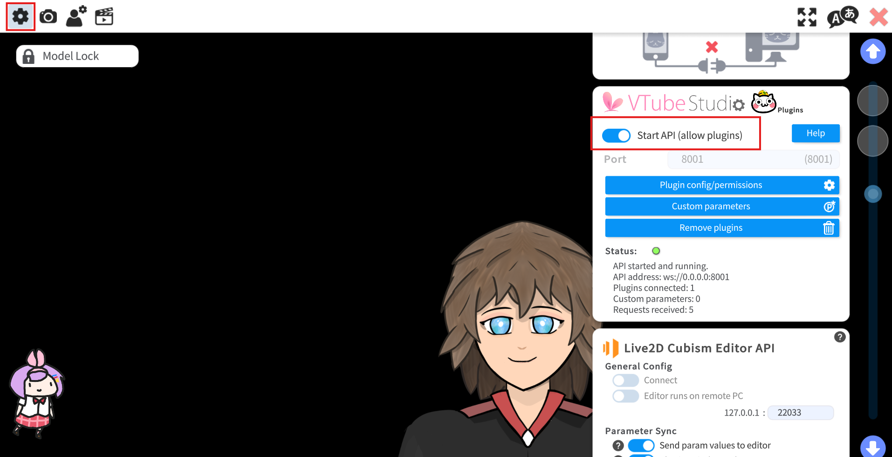
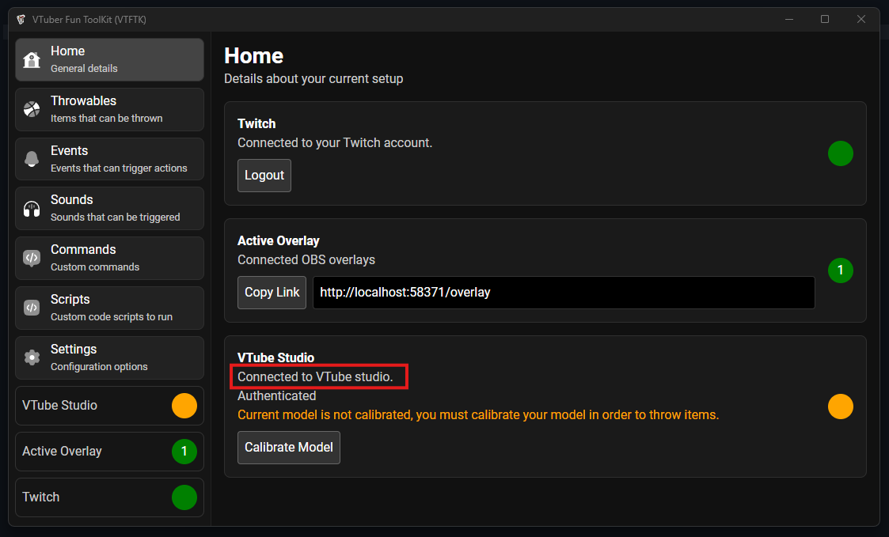

import { Aside } from '@astrojs/starlight/components';

You must connect **VTFTK** to VTube Studio in order for items to be thrown and to have your model flinch.

First, open OBS and ensure there is atleast 1 connected overlay

Start up VTube studio, after starting VTube studio you will see a prompt like the following asking you to allow access to **VTFTK** press "Allow"

<Aside>
    If you do not see this popup, head over to your VTube Studio settings

Ensure the "Start API" option is enabled. If you have changed your "Port" ensure you update the port in the **VTFTK** app settings

</Aside>

Back in **VTFTK** you should now see that the VTube Studio section says "Connected to VTube Studio" and is orange

