You must calibrate your model before anything can be thrown at it. This is how **VTFTK** knows which
part of the screen to throw items towards.

First open both VTube Studio and OBS.

Press the "Calibrate Model" button in **VTFTK**

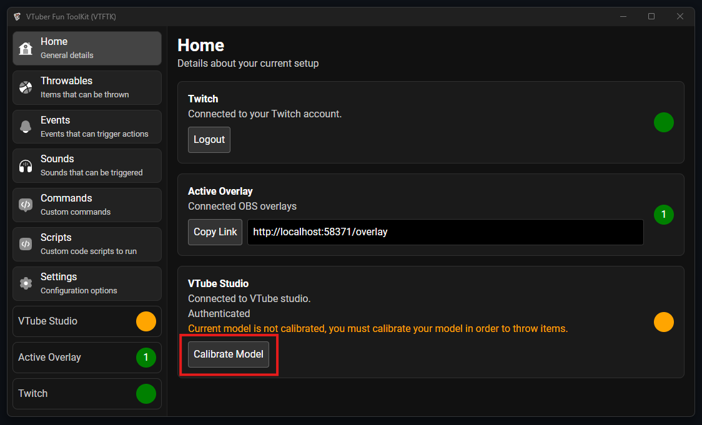

Press the "Start" button to begin calibration

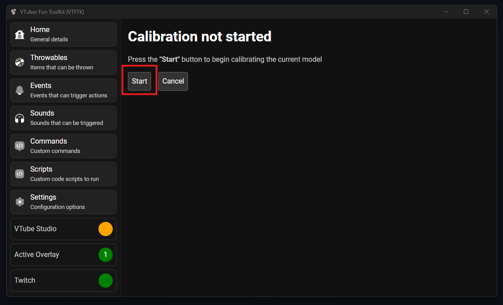

You will see the following screen with instructions for the first calibration step

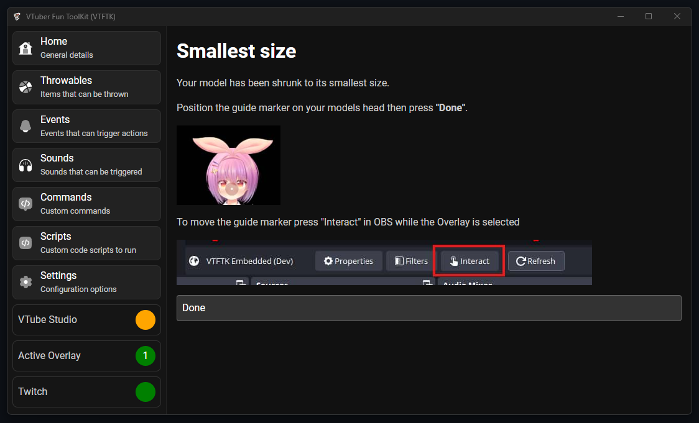

Your VTube Studio model will have been shrunken to its smallest size. Head over to OBS

Select the "VTFTK" source you created in the "Overlay" step, and press the "Interact button

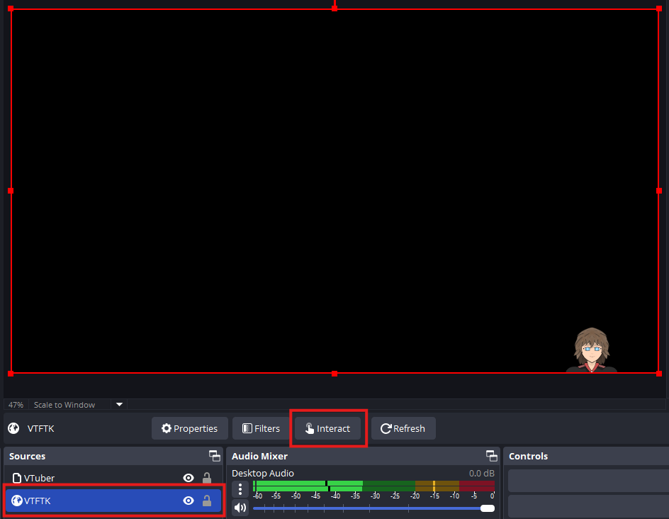

You should see a red dot appear in the middle of your screen

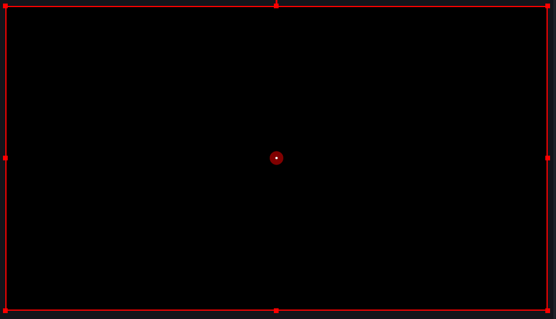

The dot will follow your mouse, move your mouse over to where you VTuber model usually would appear. If you model is off the screen attempt to place it as close as possible (Like in the screenshot below) click to place the dot 

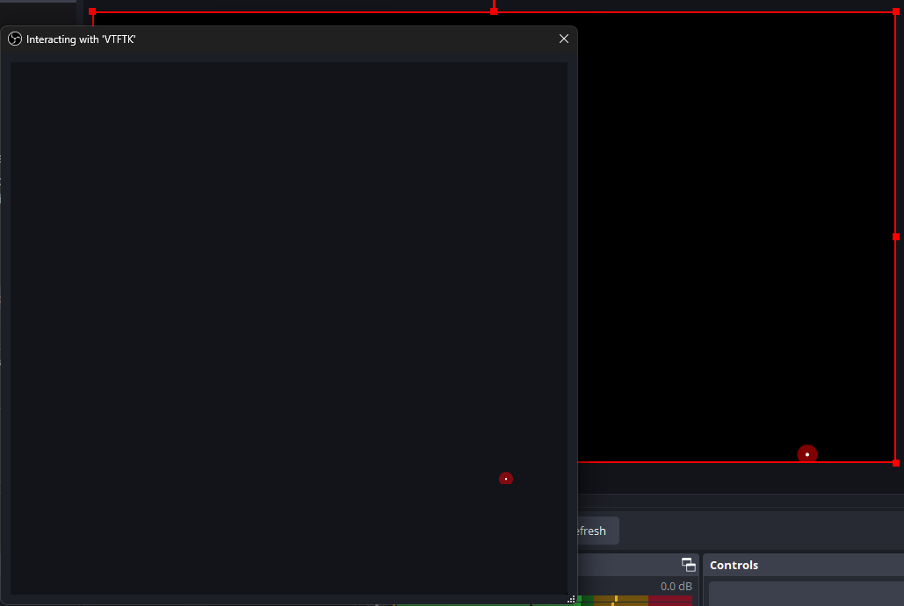

After you've positioned the dot and clicked to save the position press the "Done" button back over in **VTFTK**

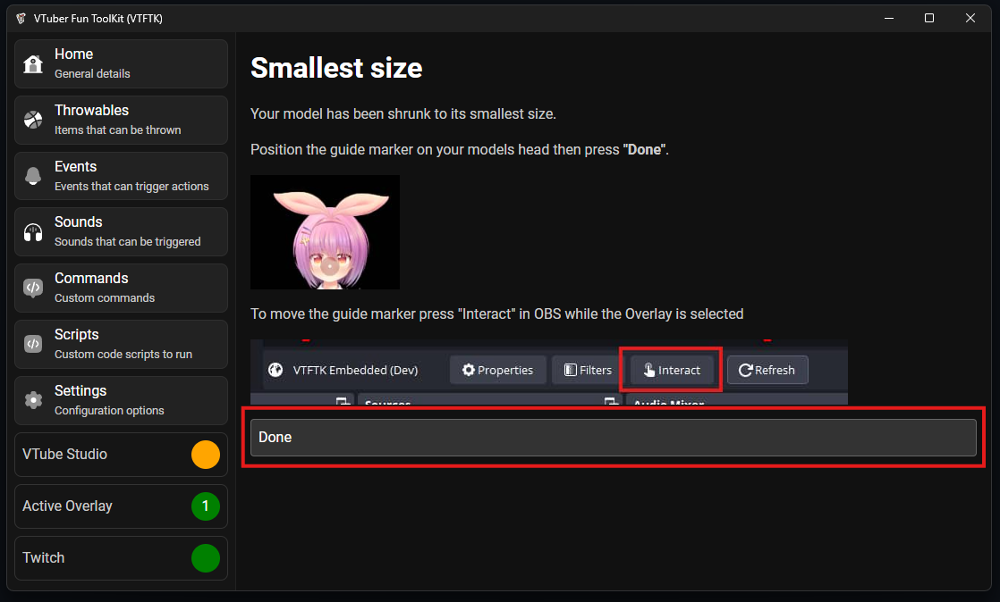

This will move you to the next calibration step where your model will become as large as possible.

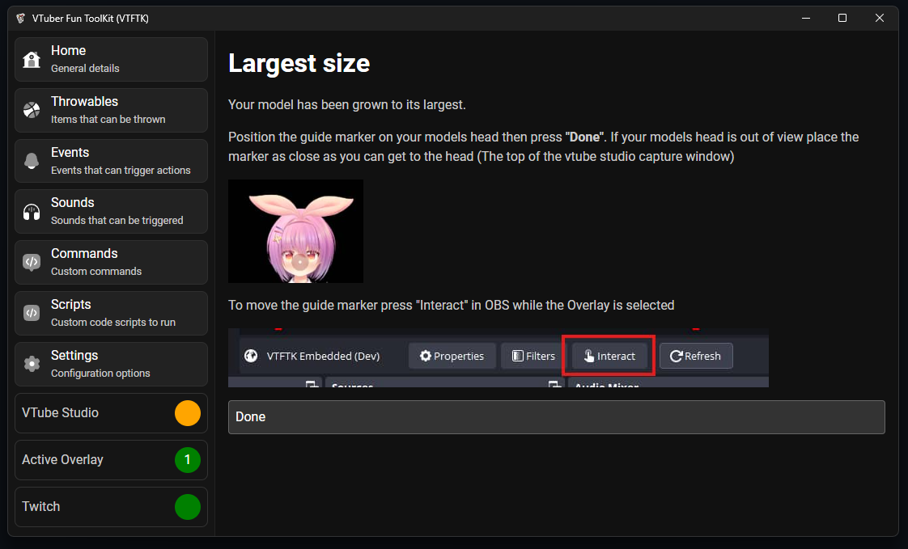    

Position the calibration dot on your models head (If your model is still within view), if your model goes outside of the vtube studio window capture
position the dot as close as to the top (As seen in the screenshot)

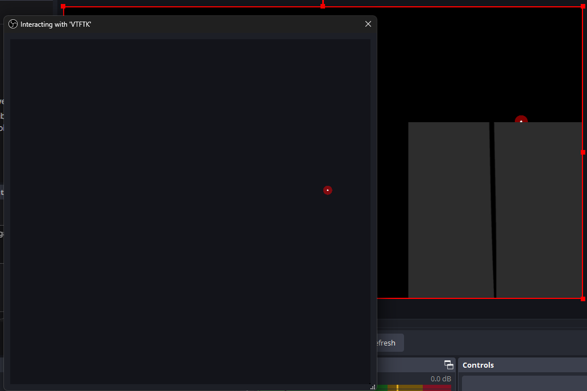

Press the "Done" button to continue

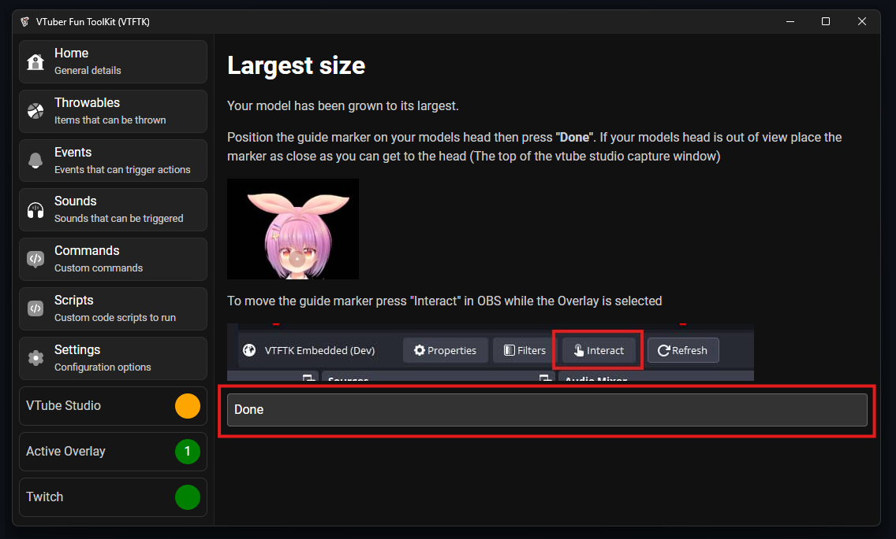

Calibration is now complete and you can push the "Close" button

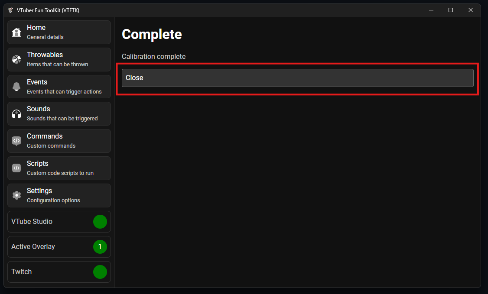

You should now see that your model is calibrated in VTube Studio

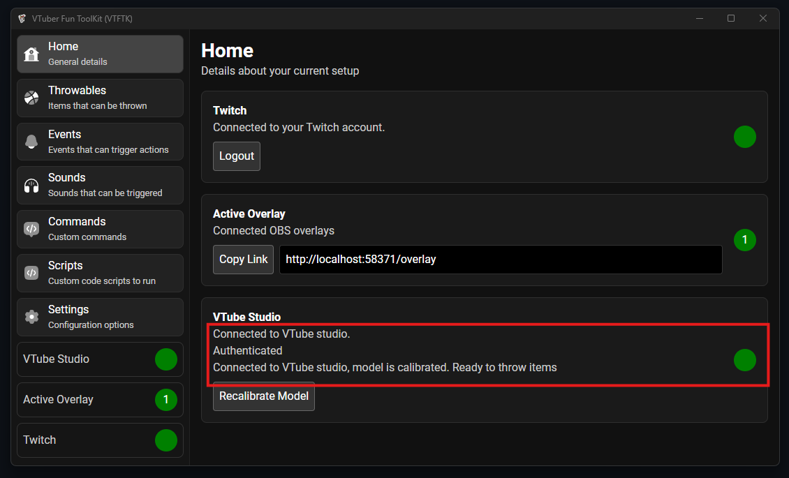